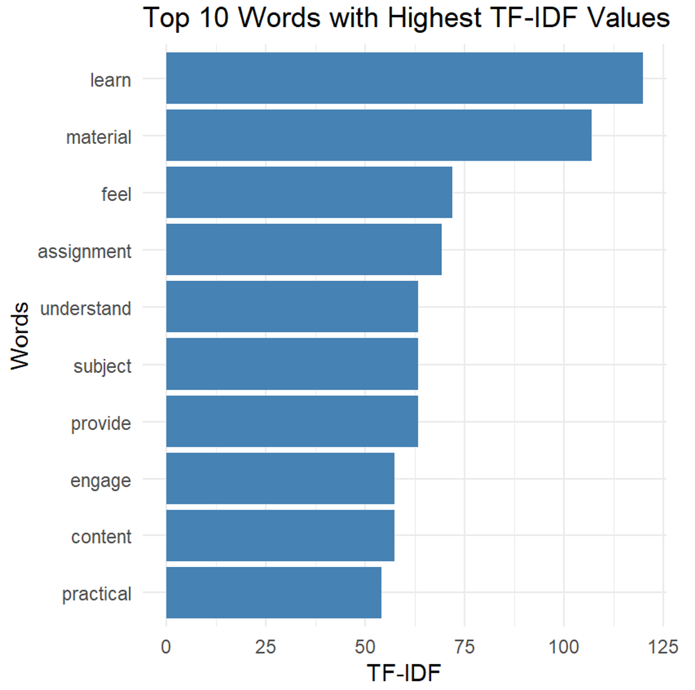
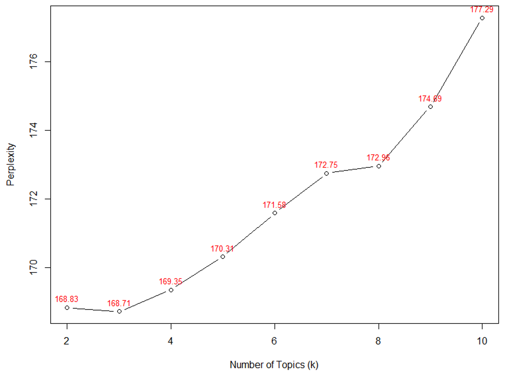
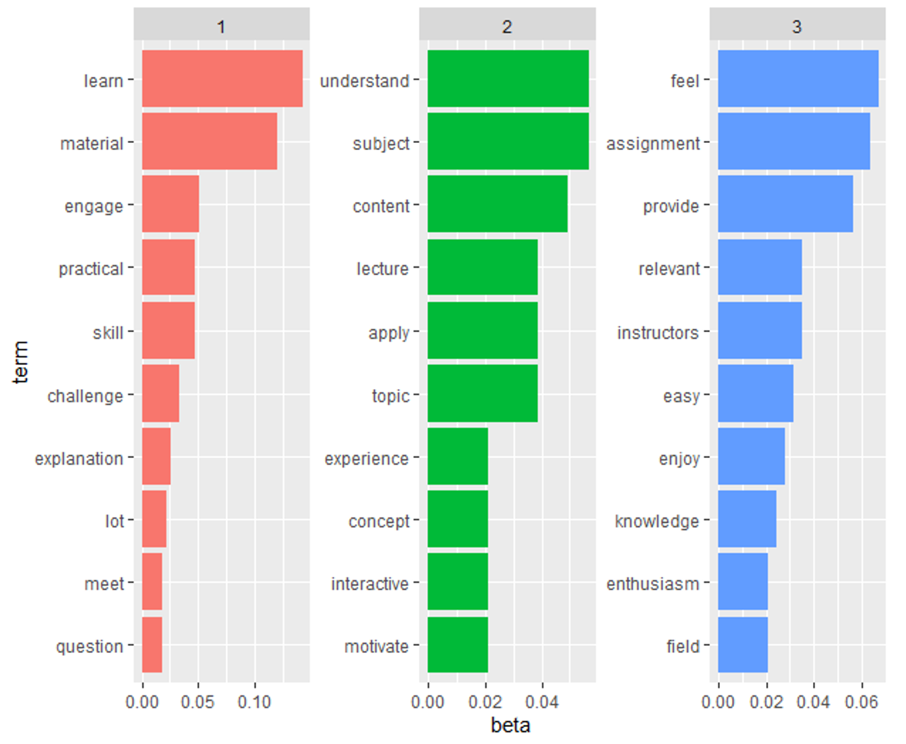
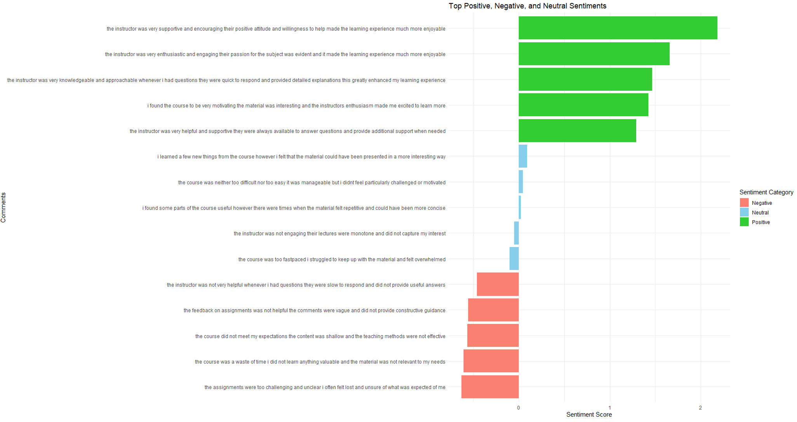
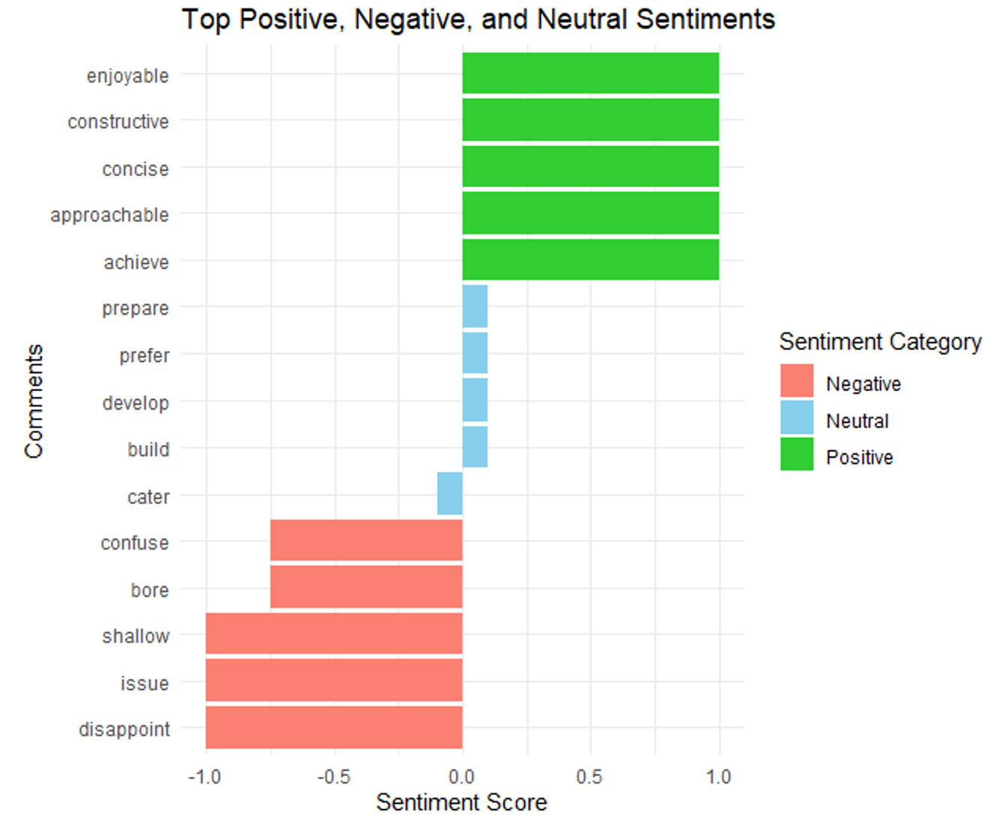

## Introduction

In the educational context, using written text is equally important as using numerical components for teachers to make informed decisions in their pedagogical strategies. For example, teachers may use students’ essays rather than a multiple-choice exam to evaluate their writing proficiency. With the increased use of educational technologies in the classroom, utilizing textual data has become more crucial in maximizing the effectiveness of learning analytics (LA) systems [@allen2022]. The use of textual data is made possible through the application of natural language processing (NLP)—an artificial intelligence-driven technique designed to manipulate, transform, and extract insights from text [@bengfort2018]. In fact, NLP comprises several subfields that cover its vast capability, from syntactic text processing, reasoning, and text generation [@schopf2023].

In this chapter, we concentrate on selected NLP techniques relevant to LA, including text preprocessing (tokenization, stemming, lemmatization), frequency-based analysis (e.g., Term Frequency-Inverse Document Frequency, or TF-IDF), topic modeling (Latent Dirichlet Allocation, or LDA), text summarization, and sentiment analysis. These techniques are primarily found within fields of study focused on text mining and information extraction—key areas in NLP concerned with generating insights from textual data [@schopf2023]. Such techniques could be applied to textual data sources within the LA environment, such as student feedback, forum posts, online discussions, and course materials. This application could provide insights into student behaviors, learning patterns, and educational content.

The chapter starts by discussing foundational concepts and terminologies in NLP, such as lexical, syntax, and corpus. Then, we explain the importance of text preprocessing in NLP and discuss various methods such as tokenization, stemming, lemmatization, and stop word removal. Practical demonstrations of these techniques are provided, leveraging R packages such as tm [@feinerer2008; @feinerer2024] and tidytext [@silge2016]. After text processing, we move the discussion to the application of NLP for text analysis with techniques such as TF-IDF analysis to identify and visualize keywords and themes across documents.

Additionally, the discussion extends to the application of topic modeling with LDA through the topicmodels package [@grün2011; @grün2024]. This serves to identify hidden themes using NLP models, thereby augmenting the insights gained from TF-IDF analyses. This progression highlights the evolution from frequency-based analyses to the application of NLP models in theme identification and interpretation. As an alternative approach to extracting key insights from textual data, this chapter explores the utilization of text summarization techniques with the lexRankr package [@spannbauer2019] applied to educational content. Contrasting with the extraction of keyword sets facilitated by TF-IDF and topic modeling methods, text summarization condenses documents into succinct sentences. This application showcases the efficacy of NLP in distilling large volumes of text into concise summaries, thereby enhancing accessibility and comprehension.

Finally, we discuss and showcase the relevance of sentiment analysis in learning analytics by analyzing sentiment in student feedback using tidytext and sentimentr [@rinker2021] packages. Information obtained from sentiment analysis could be inferred from students’ perceptions and attitudes regarding the course content, thereby providing more understanding of the pedagogical efficacy of the course. This chapter serves as a comprehensive guide for leveraging NLP techniques in learning analytics using R. This guideline provides readers with the knowledge and tools necessary to analyze and derive insights from textual data in educational contexts.

## Literature Review

### Foundational Concepts in NLP

Formally defined, NLP is a subfield of artificial intelligence that allows computers to understand, interpret, and generate human language to bridge the gap between human communication and computer understanding [@bengfort2018]. NLP can transform unstructured text into structured data that can be easily analyzed and utilized for various applications, such as sentiment analysis, machine translation, speech recognition, and text summarization. Textual data in NLP has several levels/aspects/dimensions that can be described by the following terminologies by @bengfort2018 and @allen2022.

1.  Tokens: Tokens are the basic units of text, often corresponding to words, phrases, or symbols such as “learn” or “students”;

2.  Lexicon: A lexicon is a collection of words and their corresponding meanings. For example, “chemistry”, “space”, “physics”, or “cell” are part of the science lexicon;

3.  Semantics: Semantics is concerned with the meaning of words, phrases, and sentences and their relationships within their context;

4.  Corpus: A corpus is a large and structured set of texts used for training and evaluating NLP models. It serves as the foundational data for various NLP tasks, providing context and examples for algorithms to learn from. These four terminologies describe textual data from individual words or a collection of words or phrases with their meaning. To illustrate these concepts, consider the sentence 'Students study cell structures in biology.'

@tbl-1 displays examples of tokens, lexicon, semantics, and corpus of such a sentence.

| NLP Terms | Examples |
|------------------------------------|------------------------------------|
| Tokens | The text is broken into individual units: 'students,' 'study,' 'cell,' 'structures,' 'in,' and 'biology.' |
| Lexicon | 'cell' is defined as the basic structural and functional unit of living organisms |
| Semantics | 'cell structures' refers to biological components rather than, for instance, the layout of telecommunications equipment. |
| Corpus | A collection of educational content related to biology |

: Examples of NLP Terms of a Sentence {#tbl-1}

Several steps are involved in transforming natural language text to a machine-readable format. These steps, collectively known as text preprocessing, convert raw text into structured data, which is essential for subsequent analysis and modeling as described by @bird2009 as follows:

1.  Tokenization: Divides text into tokens, the fundamental units of analysis.

2.  Normalization: Converts text to a uniform format by removing punctuation, converting text to lowercase, and addressing special characters, ensuring consistency (e.g., “Dog” and “dog” treated equivalently).

3.  Lemmatization: Converts words to their root forms based on context, such as “dancer,” “dancing,” and “dances” being reduced to “dance.”

4.  Stop Word Removal: Eliminates common, less meaningful words (e.g., “a,” “the”) to focus on more meaningful terms in the text.

When the textual data has been processed and is ready to be analyzed, several analyses can be done to generate insights. Firstly, TF-IDF is a statistical measure used to assess a word's importance in a document within a corpus. It uses two metrics: term frequency (TF), which counts how often a term appears in a document, and inverse document frequency (IDF), which gauges a term's significance by examining its rarity across all documents [@ramos2003]. The TF-IDF value rises with the word's frequency in a document but is balanced by its prevalence in the corpus [@ramos2003]. Hence, frequently appearing words are deemed important, but overly common words are considered less significant. For instance, the word "science" in a science corpus would be expected and thus may not provide unique insights.

Second, the latent Dirichlet allocation (LDA) method is a generative probabilistic model that can extract lists of topics from the document. Specifically, LDA assumes each document is a mixture of topics and identifies topics within a set of documents by assigning a probability distribution over words for each topic [@blei2003]. LDA can extract keywords by identifying highly probable words within specific topics, providing insights into the thematic structure of the text in addition to the keywords identified by the TF-IDF method [@wheeler2021].

Third, the text summarization technique serves to condense a long piece of text into a shorter version while preserving its main ideas. There are two main approaches to text summarization: extractive and abstractive. Abstractive text summarization generates new sentences that convey the main ideas of the original text, similar to how humans summarize, through the use of advanced NLP models such as the Bidirectional Autoregressive Transformer [@sharma2023]. This approach, however, is not the focus of this tutorial as it currently doesn’t have a means of implementation in R. Extractive text summarization, which is covered in this chapter, selects critical sentences or phrases directly from the original text to create a summary by ranking sentences based on features such as sentence position, length, term frequency, and similarity to the title [@rahimi2017].

Finally, sentiment analysis can determine the emotional tone of the text by classifying it as positive, negative, or neutral. Various NLP models and techniques can be employed for sentiment analysis, including lexicon-based approaches and machine learning models [@santoshkumar2021]. An example of a lexicon-based approach is the utilization of the Valence Aware Dictionary and sEntiment Reasoner (VADER) model that uses syntactic rules to determine scores from lexical features (e.g., sentiment lexicons) with grammatical and syntactical conventions [@hutto2014]. An example of the machine learning approach is the utilization of a pre-trained model, such as the global vectors for word representation (GloVe), to predict sentiment categories of the given text [@pennington2014]. These four techniques extract insights from the textual data at several levels as means of data reduction, from text to keywords to short summary and inferred property of text sentiment.

### The Relevance of NLP in the LA Context

In the LA context, several textual components are involved, ranging from the written curriculum, syllabus, course content, teachers’ written feedback, and even student feedback after the course is completed. Insights drawn from these data sources are valuable in guiding the advancement of educational technologies from the student level (e.g., determining at-risk students) to the task level (e.g., predicting item difficulty) [@allen2022]. NLP can significantly enhance student performance by analyzing their input, such as responses to quizzes or exams, and providing automated feedback [@li2021].

Feedback generated by NLP can be delivered at various levels: task-level (e.g., providing a direct answer), process-level (e.g., offering verbal hints), and self-regulated learning level (e.g., generating context-relevant feedback to encourage self-reflection) [@hattie2007; @wongvorachan2022]. An example of such innovation is AcaWriter, a writing assistance tool that provides real-time feedback on students' written work, such as essays and reports, focusing on aspects like clarity and conciseness [@knight2020]. Beyond benefiting students, NLP can also assist instructors by evaluating the quality of their written feedback, categorizing it as effective, mediocre, or ineffective [@ötles2021]. This innovation supports learning on multiple fronts, enhancing both student self-assessment and the effectiveness of instructor feedback.

Furthermore, NLP can analyze extensive volumes of text from syllabi, course materials, and educational resources such as theses, reducing them to their essential elements that contain only the most relevant information [@goddard2021]. This distilled information can then inform instructors' decisions. For instance, instructors may utilize text summarization and topic modeling to condense a corpus of syllabi into topic lists and concise summaries, thereby aiding the course design process by making it more efficient. For example, instructors can use topic modeling to understand themes of student discussions in a text-rich environment such as massive open online courses [@ezen-can2015]. In educational research, topic modeling can also be used to identify clusters of keywords in textual metadata such as abstracts to understand progress of the field [@derntl2013].

NLP can also predict item characteristics, such as item difficulty (represented by the proportion of correctness), mean response time, and item discrimination (i.e., biserial correlation), by analyzing linguistic features like average word length, complex word count, readability, concreteness rating, and word frequency (to identify rare words) [@yaneva2023]. This capability enables teachers to assess predicted item properties before implementation, determining whether an item is too difficult, too easy, or appropriately challenging.

Additionally, NLP can provide machine translation, which is particularly beneficial in scenarios involving second-language learners [@goddard2021]. Given the prevalence of foreign language learners in modern education, embedding machine translation features in an LA dashboard can increase accessibility to lesson content and enhance feedback comprehension [@lee2023; @wongvorachan2022]. These examples demonstrate the significant potential of integrating NLP within the LA context to enhance educational practices at multiple levels.This NLP application allows educational institutions to gain deeper insights into student behaviors, optimize curriculum design, and improve feedback and assessment processes.

## Tutorial with R

We start by installing and importing the following packages:

```{r, message = FALSE, error = FALSE, warning = FALSE, eval = FALSE}
# install.packages(c("tidytext", "tm", "textstem", "dplyr", "ggplot2", "topicmodels", "lexRankr", "sentimentr", "tidyr"))

library(tidytext) # for text cleaning and tokenization #https://www.tidytextmining.com/
library(tm) # for TF-IDF calculation
library(textstem) #for text stemming
library(dplyr) #for pipeline and data management
library(ggplot2) #for plotting
library(topicmodels) #for LDA topic modeling
library(lexRankr) #for text summarization
library(sentimentr) #for sentiment analysis
library(tidyr) #for dataset transformation
```


```{r, message = FALSE, error = FALSE, warning = FALSE, echo = FALSE}
library(tidytext) # for text cleaning and tokenization #https://www.tidytextmining.com/
library(tm) # for TF-IDF calculation
library(textstem) #for text stemming
library(dplyr) #for pipeline and data management
library(ggplot2) #for plotting
# library(topicmodels) #for LDA topic modeling
library(lexRankr) #for text summarization
library(sentimentr) #for sentiment analysis
library(tidyr) #for dataset transformation
```

The double colon (`::`) notation is used in our code to identify the package from which each function comes. This approach enhances clarity for readers who may wish to utilize specific functions from the tutorial.

### Text Preprocessing

In this chapter, we use a dataset consisting of students' comments on a course evaluation. The dataset can be downloaded from this hyperlink. We first need to import the data into R. This is accomplished using the read.csv function, which reads a file in CSV (comma-separated values) format and creates a data frame. The specific command used is `df <- read.csv('df.csv', stringsAsFactors = FALSE)`. Here, `df.csv` is the name of the CSV file containing the students' comments, and `stringsAsFactors = FALSE` ensures that text data is imported as strings rather than being converted to factors, which is useful for text analysis.

```{r, message = FALSE, error = FALSE, warning = FALSE}
df <- read.csv(url(
  'https://raw.githubusercontent.com/lamethods/data2/refs/heads/main/feedback/df.csv'
  ), stringsAsFactors = FALSE)
```

After importing the data, we can take a quick look at the first few entries by using the head function. The command `head(df, 3)` returns the first three rows of the data frame, providing an initial glimpse of the comments. In this example, we see three detailed comments on various aspects of the course, such as the interactive sessions, up-to-date content, and the instructor's responsiveness.

```{r, message = FALSE, error = FALSE, warning = FALSE }
head(df,3)
```

 
Additionally, the ‘dim’ function is used to check the dimensions of the data frame with the command `dim(df)`, which in this case returns `[1] 100 1`. This indicates that the data frame contains 100 rows and 1 column, confirming that we have 100 comments from students to analyze. By importing and briefly inspecting our data, we set the stage for a deeper analysis of students' feedback, which can provide valuable insights into the strengths and areas for improvement in the course.

```{r, message = FALSE, error = FALSE, warning = FALSE}
dim(df)
```

After importing the dataset into our R environment, we can proceed with text cleaning. This involves transforming and standardizing the raw text to ensure consistency and remove noise, making it easier to extract meaningful insights. First, the comments are tokenized using the `unnest_tokens` function, which splits each comment into individual words, creating a tidy data frame where each row represents a single word. This is done with the command `token <- df %>% unnest_tokens(output = word, input = Student_comment)`.

```{r, message = FALSE, error = FALSE, warning = FALSE}
token <- df %>%
  unnest_tokens(output = word, input = Student_comment)
```

Next, all words are converted to lowercase using `token$word <- tolower(token$word)`, ensuring uniformity by eliminating discrepancies caused by capitalization. The words are then lemmatized with `token$word <- lemmatize_words(token$word)`, which reduces words to their base or dictionary form. For example, "running" would be reduced to "run".

```{r, message = FALSE, error = FALSE, warning = FALSE}
token$word <- tolower(token$word)
token$word <- lemmatize_words(token$word)
```

To remove common but uninformative words, custom stop words specific to this context, such as "student", "course", and "instructor", are defined and removed from the data. This is accomplished by merging a predefined list of stop words with the custom list and using the `anti_join` function. Numbers, which are often not useful in text analysis, are removed with `token$word <- gsub("\\d+", "", token$word)`. Empty tokens resulting from this cleaning are filtered out using `token <- token %>% filter(word != "")`. Lastly, all punctuation is removed using `token$word <- tm::removePunctuation(token$word)`, ensuring that only words remain.

```{r, message = FALSE, error = FALSE, warning = FALSE}
custom_stop_words <- c("student", "course", "instructor", "instructors", "students")

token <- token %>% 
  anti_join(stop_words %>% bind_rows(tibble(word = custom_stop_words, lexicon = "custom")))


token$word <- gsub("\\d+", "", token$word) # remove numbers
token <- token %>% filter(word != "") # remove empty tokens
token$word <- tm::removePunctuation(token$word) #remove all punctuation
```

After these cleaning steps, the dim function shows that we have 842 words (`dim(token)`), and the head function reveals the first ten cleaned words (`head(token, 10)`), indicating that the text is now ready for further analysis. This process effectively standardizes the text, reduces noise, and focuses on meaningful content for subsequent NLP tasks.

```{r, message = FALSE, error = FALSE, warning = FALSE}
dim(token)

head(token, 10)
```

### Keyword Identification with TF-IDF

Keyword identification using TF-IDF is a crucial technique in NLP for identifying the most significant words in a collection of documents. TF-IDF helps to highlight important words that are unique to individual documents within a corpus while downplaying words that are common across multiple documents.

The process begins with counting the occurrence of each word in each document. This is achieved with the command `word_counts <- token %>% count(document = row_number(), word)`, which creates a data frame where each row represents the frequency of a word in a specific document.

```{r, message = FALSE, error = FALSE, warning = FALSE}
# Count the occurrence of each word in each document
word_counts <- token %>% count(document = row_number(), word)
```

Next, the raw term frequency, which is the total count of each word across all documents, is calculated using `raw_term_frequency <- word_counts %>% count(word)`. Following this, the document frequency is determined, which counts the number of documents in which each word appears. This is computed with `document_frequency <- word_counts %>% group_by(word) %>% summarise(docs = n_distinct(document))`.

```{r, message = FALSE, error = FALSE, warning = FALSE}
# Calculate raw term frequency
raw_term_frequency <- word_counts %>% count(word)

# Calculate document frequency
document_frequency <- word_counts %>% group_by(word) %>% summarise(docs = n_distinct(document))
```

The Inverse Document Frequency (IDF) is then calculated. IDF measures how unique or rare a word is across all documents in the corpus. It is calculated as the logarithm of the total number of documents divided by the number of documents containing the word. The TF-IDF score for each word is obtained by multiplying its raw term frequency by its IDF value. This combines the importance of the word in a specific document with its rarity across the corpus.

```{r, message = FALSE, error = FALSE, warning = FALSE}
# Calculate IDF
idf <- document_frequency %>% mutate(idf = log(nrow(word_counts) / docs))

# Join raw term frequency and IDF
tf_idf <- raw_term_frequency %>% inner_join(idf, by = "word") %>% mutate(tf_idf = n * idf)

```

To visualize the results, the top 10 words with the highest TF-IDF values are selected and plotted. This is done by arranging the words in descending order of their TF-IDF scores and selecting the top 10. The selected words are then plotted using a bar chart with the `ggplot2` [@wickham2016], where the words are displayed along the x-axis and their TF-IDF scores on the y-axis.

```{r, message = FALSE, error = FALSE, warning = FALSE}
# Plot the top 10 important words

# Select the top 10 words with the highest TF-IDF values
top_10 <- tf_idf %>% arrange(desc(tf_idf)) %>% head(10)
```

```{r, message = FALSE, error = FALSE, warning = FALSE, eval = FALSE}
# Create a bar chart
ggplot(top_10, aes(x = reorder(word, tf_idf), y = tf_idf)) +
  geom_bar(stat = "identity", fill = "steelblue") +
  coord_flip() +
  labs(x = "Words", y = "TF-IDF", title = "Top 10 Words with Highest TF-IDF Values") +
  theme_minimal()
```

The output of this process provides a list of the top 10 words with the highest TF-IDF values. Output 1 and @fig-1 show that words like "learn," "material," and "feel" are among the most significant in the student comments, as indicated by their high TF-IDF values. These words are particularly important because they are frequently used in the comments while being relatively unique to specific documents, highlighting their significance in the context of the course evaluation.

**Output** 1. Bar Plot of TF-IDF Based Important Word

```{r, message = FALSE, error = FALSE, warning = FALSE}
top_10
```

{#fig-1}

### Identifying Hidden Themes with Topic Modeling

Identifying hidden themes in textual data using Topic Modeling is a powerful technique in NLP that helps uncover the underlying structure and prevalent topics within a collection of documents. One common method for topic modeling is LDA, which assumes that each document is a mixture of several topics and that each topic is a mixture of words with certain probabilities [@blei2003].

The process begins with creating a Document-Term Matrix (DTM), which is a matrix where rows represent documents and columns represent words, with the entries indicating the frequency of each word in each document. Next, we set hyperparameters for the LDA model. The alpha parameter controls the distribution of topics within documents, with a higher alpha resulting in a more specific topic distribution per document. These parameters are adjusted through experimentation to achieve the best results. The control_list sets these parameters:

```{r, message = FALSE, error = FALSE, warning = FALSE, eval = F}
# Creating a Document-Term Matrix
dtm <- token %>%
  count(document = row_number(), word) %>%
  cast_dtm(document, word, n)

# Adjusting hyperparameters alpha and beta
control_list <- list(seed = 1234, alpha = 0.1)
#higher alpha results in a more specific topic distribution per document.
#Alpha and k are determined by experimenting
```

We then fit the LDA model to our DTM, specifying the number of topics (k) we want to identify. The optimal number of topics can be determined using various methods such as qualitative interpretation by the researcher or use the perplexity score to evaluate how well the model fits the data. We utilized the perplexity method due to its popularity and simplicity in implementation within the `topicmodels` package [@grün2011; @neishabouri2020]. Lower perplexity generally indicates a better fit of the LDA variant, determined by the number of topics. In this chapter, we iterated over values of k and selected the number of topics that minimize perplexity.

```{r, message = FALSE, error = FALSE, warning = FALSE, eval = FALSE}
# Loop through various values of k
perplexity_values <- sapply(2:10, function(k) {
  model <- LDA(dtm, k = k, control = control_list)
  perplexity(model)
})
plot(2:10, perplexity_values, type = "b", xlab = "Number of Topics (k)", ylab = "Perplexity")

# Add perplexity value labels above each point
text(2:10, perplexity_values, 
     labels = round(perplexity_values, 2), 
     pos = 3,       # Position text above the points
     cex = 0.8,     # Text size
     col = "red")   # Text color

```

@fig-2 shows the value of the perplexity score and the number of topics from LDA. The LDA variant of 3 topics was shown to have the lowest perplexity score (168.71) and therefore, determined as the optimal number of topics.

{#fig-2}

As informed by the perplexity score, k is set to 3, and the model is fitted using the LDA function from the `topicmodels` library.

```{r, message = FALSE, error = FALSE, warning = FALSE, eval = FALSE}
# Fitting the LDA Model
lda_model <- LDA(dtm, k = 3 #k is the beta parameter
                 , control = control_list)
```

To view the top terms associated with each topic, we extract the probabilities of each word within each topic using the tidy function, which converts the model output into a tidy data frame. We then group these terms by topic, selecting the top 10 words with the highest probabilities (beta values) for each topic. Finally, we visualize the top terms for each topic using a bar chart, which helps in understanding the dominant words within each topic.

```{r, message = FALSE, error = FALSE, warning = FALSE, eval = FALSE}
terms(lda_model, 10)

# Get the probabilities of each word in each topic
lda_terms <- tidy(lda_model, matrix = "beta")

top_terms <- lda_terms %>%
  group_by(topic) %>%
  top_n(10, beta) %>%
  ungroup() %>%
  arrange(topic, -beta)
```

Output 2 shows samples of identified key terms within topic 1. The topic column indicates the topic number, the term column lists the top words for each topic, and the beta column shows the probability of each term within the topic. For example, in Topic 1, the most significant words are "learn" and "material," with beta values of 0.142 and 0.120, respectively. These words are the most representative of Topic 1, indicating the theme of this topic likely revolves around learning and materials.

@fig-3 shows bar plots of top 10 terms from all 3 topics. Some of the top terms for topic 1 are "learn" and "material". Some of the top terms for topic 2 are "understand" and "subject". Some of the top terms for topic 3 are "feel" and "assignment". By analyzing these top terms, we can infer the central themes of each topic, which provides insights into the main areas of focus in the student comments. This approach helps educators and analysts understand the key themes and issues expressed by students, facilitating data-driven improvements to the course.

**Output** 2. Top 10 Terms from Topic 1

```{r, message = FALSE, error = FALSE, warning = FALSE, eval = FALSE}
# View the top terms for each topic
print(top_terms)
```

```
# A tibble: 30 × 3
topic term beta
<int> <chr> <dbl>
1 1 learn 0.142
2 1 material 0.120
3 1 engage 0.0511
4 1 practical 0.0474
5 1 skill 0.0474
6 1 challenge 0.0328
7 1 explanation 0.0255
8 1 lot 0.0219
9 1 meet 0.0182
10 1 question 0.0182
# ℹ 20 more rows
# ℹ Use `print(n = ...)` to see more rows
```

```{r, message = FALSE, error = FALSE, warning = FALSE, eval = FALSE}
# View the top terms for each topic
top_terms %>%
  mutate(term = reorder_within(term, beta, topic)) %>%
  ggplot(aes(beta, term, fill = factor(topic))) +
  geom_col(show.legend = FALSE) +
  facet_wrap(~ topic, scales = "free") +
  scale_y_reordered()
```

{#fig-3}

### Extracting the Most Representative Text Instances with Extractive Text Summarization

Extractive text summarization is used to identify and extract the most representative sentences from a larger body of text. This technique is particularly useful in educational contexts where we aim to condense student feedback or other textual data into concise summaries that highlight the key points. In R, the `lexRankr` package [@spannbauer2019] is commonly used to perform this task via the LexRank algorithm, which measures the relative importance of sentences in a document.

We first start by loading the lexRankr library, which contains functions for text summarization [@spannbauer2019]. Next, we use the lexRank function to summarize student comments. The parameters specify that the function should consider three sentences (`n = 3`), use PageRank to measure sentence importance, use a weighted graph representation (`continuous = TRUE`), and treat each sentence as a separate document (`sentencesAsDocs = TRUE`). Text cleaning options such as removing punctuation and numbers are also set.

```{r, message = FALSE, error = FALSE, warning = FALSE}
#---------------Text Summarization--------------
library(lexRankr)

# Summarize the text using LexRank
summary_result <- lexRankr::lexRank(text = df$Student_comment, docId = "create", 
                                    n = 3,
                                    usePageRank = TRUE, #to measure relative importance
                                    continuous = TRUE, #use a weighted graph representation of the sentences
                                    sentencesAsDocs = TRUE, #useful for single document extractive summarization 
                                    #text cleaning
                                    removePunc = TRUE,
                                    removeNum = TRUE, 
                                    toLower = FALSE, stemWords = FALSE, rmStopWords = FALSE, #These are set to false to retain meaning of the sentences
                                    Verbose = TRUE)
```

Subsequently, we reorder the top three sentences to appear in the order they were in the original text. The result, `ordered_top_3`, contains the top three sentences.

```{r, message = FALSE, error = FALSE, warning = FALSE}
#reorder the top 3 sentences to be in order of appearance in article
order_of_appearance = order(as.integer(gsub("_","",summary_result$sentenceId)))

#extract sentences in order of appearance
ordered_top_3 = summary_result[order_of_appearance, "sentence"]
```

Output 3 displays the top three sentences extracted from a larger set of student comments using the LexRank algorithm. These sentences are considered the most representative or important based on their relevance and context within the original text.

**Output** 3. The 3 Most Representative Sentences from the Student Comments

```{r, message = FALSE, error = FALSE, warning = FALSE}
print(ordered_top_3)
```

The first sentence, “the course content was very relevant to my field.”, highlights a positive aspect of the course, indicating that the material covered was pertinent to the student's area of study. It suggests that the course content met the expectations and needs of students, providing them with useful knowledge directly applicable to their field.

The second sentence, “the assignments were very relevant to the course material.”, underscores the alignment between the assignments and the course material. It implies that the tasks assigned to students were well-designed to reinforce the concepts taught in the course, helping students to apply what they learned in practical ways.

The third sentence, “The material was dry, and the instructor was not engaging.”, contrasts with the positive feedback of the previous sentences by pointing out a negative aspect. This indicates that the course material was uninteresting and that the instructor's teaching style did not capture the students' attention. This feedback highlights areas for improvement in course delivery and engagement strategies.

These three sentences together provide a balanced summary of student feedback, reflecting both strengths and areas for improvement in the course. By including both positive and negative comments, the summary offers a more comprehensive view of the students' experiences.

Next, we can extend the summarization process by computing LexRank scores for each sentence in a dataframe. We first add an index column to the original dataframe, facilitating easier reference during analysis.

```{r, message = FALSE, error = FALSE, warning = FALSE}
#Bind Lexrank score to a dataframe
df_lexrank <- cbind(Index = 1:nrow(df), df)
```

Then, Text preprocessing is performed to standardize the text for analysis. This includes converting text to lowercase, removing punctuation and numbers, and stripping extra whitespace. These steps ensure that the text is clean and uniform, ready for the next processing stages. However, We did not remove stopwords and perform lemmatization for this task, because it strips away the meaning. This is because we are doing sentence level analysis, not word-level.

```{r, message = FALSE, error = FALSE, warning = FALSE}
clean_text_lexrank <- df_lexrank %>%
  mutate(Student_comment = tolower(Student_comment)) %>%          # Convert to lower case
  mutate(Student_comment = removePunctuation(Student_comment)) %>% # Remove punctuation
  mutate(Student_comment = removeNumbers(Student_comment)) %>% #Remove numbers
  mutate(Student_comment = stripWhitespace(Student_comment))       # Strip whitespace
```

Subsequently, the cleaned text is broken down into individual sentences (`unnest_tokens`) and LexRank scores are computed (`bind_lexrank`). LexRank evaluates each sentence based on its similarity and importance relative to other sentences in the document, producing scores that quantify each sentence's representativeness.

```{r, message = FALSE, error = FALSE, warning = FALSE}
# Use lexRankr to compute LexRank scores
lexrank_result <- clean_text_lexrank %>%
  unnest_tokens(sentence, Student_comment, token = "sentences") %>%
  lexRankr::bind_lexrank(sentence, Index, level = "sentences")
```

The computed LexRank scores are used to identify the top five sentences (`head(n = 5)`) that are most representative of the entire text. These sentences are selected based on their high LexRank scores, indicating their significance within the document. Finally, the output is examined to ensure that it is a dataframe. This dataframe output format can be further analyzed as needed rather than a stand-alone text output.

```{r, message = FALSE, error = FALSE, warning = FALSE}
# Arrange and select top sentences
top_sentences <- lexrank_result %>%
  arrange(desc(lexrank)) %>%
  head(n = 5) %>%
  select(sentence, lexrank)

#double check if our output is really a dataframe
class(top_sentences)
top_sentences
```

@tbl-2 displays the top five sentences along with their corresponding LexRank scores. Each row represents a sentence selected for its importance in summarizing the original text. The "Lexrank score" column displays the numerical score assigned to each sentence by LexRank. Higher scores indicate sentences that are more central or important within the context of the entire document. The results are similar to Output 3, albeit in the table form.

| Rank | Sentence | Lexrank score |
|------------------------|------------------------|------------------------|
| 1 | the course content was very engaging the lectures readings and activities were all interesting and kept me motivated to learn | 0.02976320 |
| 2 | the assignments were very relevant to the course material they helped me apply what i learned in practical tasks and reinforced my understanding | 0.02594757 |
| 3 | i enjoyed the interactive discussions the group activities and discussions were very engaging and helped me learn from my peers | 0.02006878 |
| 4 | the course helped me understand the subject better the explanations were clear and the examples were relevant making the material easy to grasp | 0.01932070 |
| 5 | the instructors enthusiasm made the course enjoyable their passion for the subject was evident and made the learning experience more engaging | 0.01870971 |

: Top 5 Most Representative Sentences in the Data Frame Format {#tbl-2}

By utilizing extractive text summarization with LexRank in R, educators and researchers can efficiently distill meaningful insights from large volumes of textual data, aiding in tasks such as summarizing student feedback, generating concise reviews, or extracting critical information from academic papers. This approach streamlines the process of information retrieval and synthesis, making it a valuable tool in educational and research contexts.

### Examining Students’ Perception with Sentiment Analysis

Sentiment analysis, also known as opinion mining, is a technique used to identify and extract subjective information from text data [@santoshkumar2021]; It involves determining the emotional tone behind a series of words to understand the attitudes, opinions, and emotions expressed within the text. This process is particularly useful in analyzing feedback, reviews, and opinionated posts, as it helps in understanding public sentiment towards products, services, or events.

#### Sentence-Level Sentiment Analysis

Sentence-level sentiment analysis evaluates the sentiment expressed within individual sentences, providing insights into the overall emotional tone conveyed by the text. This analysis allows for a more detailed understanding of specific feedback elements. The process involves several steps as follows:

First, textual data needs to be preprocessed to ensure consistency in the data. The `mutate()` function is used to convert all text to lowercase (`tolower()`) and remove punctuation (`removePunctuation()`) from each student comment in the dataframe `df`. This standardizes the format and removes irrelevant characters, preparing the text for sentiment analysis.

```{r, message = FALSE, error = FALSE, warning = FALSE}
clean_text_sentiment <- df %>%
  mutate(Student_comment = tolower(Student_comment)) %>%          # Convert to lower case
  mutate(Student_comment = removePunctuation(Student_comment)) # Remove punctuation
```

Subsequently, the `sentiment()` function from the `sentimentr` package [@rinker2021] is then applied to compute sentiment scores (sentiment) for each individual student comment. This function uses a sentiment lexicon to assign numerical values representing the positivity or negativity of each comment. The `unnest()` function is used to expand the sentiment scores into separate rows, ensuring each sentiment score is associated with its respective comment.

```{r, message = FALSE, error = FALSE, warning = FALSE}
# Perform sentiment analysis
sentiment_result <- clean_text_sentiment %>%
  mutate(sentiment = sentiment(Student_comment)) %>%
  unnest(cols = c(sentiment))
```

Next, sentiment scores are categorized into three distinct sentiment categories ("Positive," "Negative," or "Neutral") based on predefined thresholds using case_when(). Sentences with sentiment scores above 0.1 are categorized as positive, those below -0.1 as negative, and the rest as neutral. This categorization helps in understanding the overall sentiment expressed in each student comment.

```{r, message = FALSE, error = FALSE, warning = FALSE}
# Categorize sentiment
sentiment_result <- sentiment_result %>%
  mutate(sentiment_category = case_when(
    sentiment > 0.1 ~ "Positive",
    sentiment < -0.1 ~ "Negative",
    TRUE ~ "Neutral"
  ))
```

Finally, the top five sentences (`top_positive`, `top_negative`, `top_neutral`) for each sentiment category are selected based on their sentiment scores. These sentences represent the most positively, negatively, and neutrally perceived comments within the dataset. They are combined into a single dataframe (`top_sentiments`) for further analysis or reporting. Results from the `top_sentiment` can also be visualized to provide comprehensive understandings.

```{r, message = FALSE, error = FALSE, warning = FALSE}
# Select top 5 for each category
top_positive <- sentiment_result %>%
  filter(sentiment_category == "Positive") %>%
  arrange(desc(sentiment)) %>%
  head(5)

top_negative <- sentiment_result %>%
  filter(sentiment_category == "Negative") %>%
  arrange(sentiment) %>%
  head(5)

top_neutral <- sentiment_result %>%
  filter(sentiment_category == "Neutral") %>%
  arrange(desc(abs(sentiment))) %>%
  head(5)

top_sentiments <- bind_rows(top_positive, top_negative, top_neutral)
```

```{r, message = FALSE, error = FALSE, warning = FALSE, eval = FALSE}
# Visualize the results
ggplot(top_sentiments, aes(x = reorder(Student_comment, sentiment), y = sentiment, fill = sentiment_category)) +
  geom_bar(stat = "identity", position = "dodge") +
  coord_flip() +
  labs(title = "Top Positive, Negative, and Neutral Sentiments",
       x = "Comments",
       y = "Sentiment Score",
       fill = "Sentiment Category") +  
  scale_fill_manual(values = c("Positive" = "limegreen", "Negative" = "salmon", "Neutral" = "skyblue")) +
  theme_minimal()
```

Output 4 and @fig-4 provide a structured summary of the sentiment analysis results at the sentence level. Each row in the data frame represents a sentence along with its associated sentiment score. An instance of a positive comment is "*the instructor was very supportive and encouraging. their positive and willingness to help made the learning experience much more enjoyable*". An instance of a neutral comment is "*I learned a few new things from the course, however I felt that the material could have been presented in a more interesting way*". An instance of a negative comment is "*the instructor was not very helpful whenever I had questions; they were slow to respond and did not provide useful answers*". This detailed breakdown allows educators or analysts to easily identify and interpret the sentiments expressed in student feedback, highlighting specific areas of praise or concern.

**Output** 4. Sentence-Level Sentiment Scores and Categories of Students’ Course Evaluation

```{r, message = FALSE, error = FALSE, warning = FALSE}
top_sentiments
```

{#fig-4}

#### Word-Level Sentiment Analysis

Furthermore, sentiment analysis can also be performed on individual words to examine a smaller unit of textual data that may provide insights in terms of specific keywords that students have toward a course. After text preprocessing, the text is tokenized into individual words (token) and sentiment scores (sentiment) are computed for each word using the `sentiment()` function. This function assigns sentiment scores to each word based on its lexical properties, capturing the emotional connotations associated with specific vocabulary choices.

```{r, message = FALSE, error = FALSE, warning = FALSE}
# Perform sentiment analysis
sentiment_result <- token %>%
  mutate(sentiment = sentiment(word)) %>%
  unnest(cols = c(sentiment))
```

Similar to sentence-level analysis, sentiment scores for individual words are categorized into "Positive," "Negative," or "Neutral" using `case_when()`. This categorization allows for the identification of words that contribute positively, negatively, or neutrally to the overall sentiment conveyed by student comments. To handle duplicate words across different comments, the data is aggregated using `group_by()` and `summarize()` functions. This step calculates the average sentiment score (`avg_sentiment`) for each unique word across different sentiment categories, along with the frequency count of each word.

```{r, message = FALSE, error = FALSE, warning = FALSE}
# Categorize sentiment
sentiment_result <- sentiment_result %>%
  mutate(sentiment_category = case_when(
    sentiment > 0.1 ~ "Positive",
    sentiment < -0.1 ~ "Negative",
    TRUE ~ "Neutral"
  ))

#Aggregate the data by word to get unique words and their corresponding average sentiment scores.

aggregated_sentiments <- sentiment_result %>%
  group_by(word, sentiment_category) %>%
  summarize(
    avg_sentiment = mean(sentiment),
    count = n(),
    .groups = 'drop'
  )
```

Finally, the top five words (`top_positive`, `top_negative`, `top_neutral`) for each sentiment category are selected based on their average sentiment scores (`avg_sentiment`). These words provide insights into the specific vocabulary choices that contribute positively, negatively, or neutrally to the overall sentiment expressed in student feedback.

```{r, message = FALSE, error = FALSE, warning = FALSE}
# Select top 5 for each category
top_positive <- aggregated_sentiments %>%
  filter(sentiment_category == "Positive") %>%
  arrange(desc(avg_sentiment)) %>%
  head(5)

top_negative <- aggregated_sentiments %>%
  filter(sentiment_category == "Negative") %>%
  arrange(avg_sentiment) %>%
  head(5)

top_neutral <- aggregated_sentiments %>%
  filter(sentiment_category == "Neutral") %>%
  arrange(desc(abs(avg_sentiment))) %>%
  head(5)

top_sentiments <- bind_rows(top_positive, top_negative, top_neutral)

```

Output 5 and @fig-5 presents a concise summary of sentiment expressed by specific words within the student comments. Each row in the data frame includes a word (`word`), its sentiment category (`sentiment_category`), average sentiment score (`avg_sentiment`), and frequency count (`count`). An instance of a positive comment is "enjoyable". An instance of a neutral comment is "prepare". An instance of a negative comment is "confuse". This detailed breakdown enables educators or analysts to identify key words that influence the overall sentiment of student feedback, facilitating targeted improvements or interventions based on specific linguistic cues.

**Output** 5. Word-Level Sentiment Scores and Categories of Students’ Course Evaluation

```{r, message = FALSE, error = FALSE, warning = FALSE}
top_sentiments
```

```{r, message = FALSE, error = FALSE, warning = FALSE, eval = FALSE}
# Visualize the results
ggplot(top_sentiments, aes(x = reorder(word, avg_sentiment), y = avg_sentiment, fill = sentiment_category)) +
  geom_bar(stat = "identity", position = "dodge") +
  coord_flip() +
  labs(title = "Top Positive, Negative, and Neutral Sentiments",
       x = "Comments",
       y = "Sentiment Score",
       fill = "Sentiment Category") +  
  scale_fill_manual(values = c("Positive" = "limegreen", "Negative" = "salmon", "Neutral" = "skyblue")) +
  theme_minimal()
```

{#fig-5}

By utilizing both sentence-level and word-level sentiment analysis techniques in R, educators and analysts can gain insights into the emotional responses and opinions expressed within textual data. These analyses empower informed decision-making and facilitate effective improvements in educational settings based on insights derived from student feedback.

## Concluding remarks

Understanding the various textual elements within a LA context is pivotal to advancing educational technologies and enhancing data-informed decisions. This chapter discussed the advanced application of NLP techniques to analyze and interpret complex educational data. The application of methods such as text preprocessing, TF-IDF, topic modeling, text summarization, and sentiment analysis yields deeper insights into the patterns that are only available from textual data.

The application of these NLP techniques allows educators to identify key words, themes, and inferred sentiment in data sources such as student feedback, course materials, reference documents, and other textual data, thereby facilitating more informed decision-making and teaching strategy development. For instance, analyzing sentiment in a large number of student feedback in large-scale settings such as massive open online courses can reveal attitudes towards course content without the need to manually inspect each and every data point; This application can aid in the refinement of pedagogical approaches. Similarly, topic modeling and text summarization can streamline curriculum design by distilling large volumes of text such as historical documents into manageable insights.

Ultimately, the integration of NLP in learning analytics provides useful tools for understanding and enhancing the educational experience. These methods enable the extraction of information from unstructured data, offering new avenues for improving teaching strategies, supporting student learning, and optimizing educational outcomes [@gasevic2022]. By employing these advanced NLP techniques, educational institutions can better navigate the complexities of modern education and foster environments conducive to effective learning and teaching.


::: {#refs}
:::
