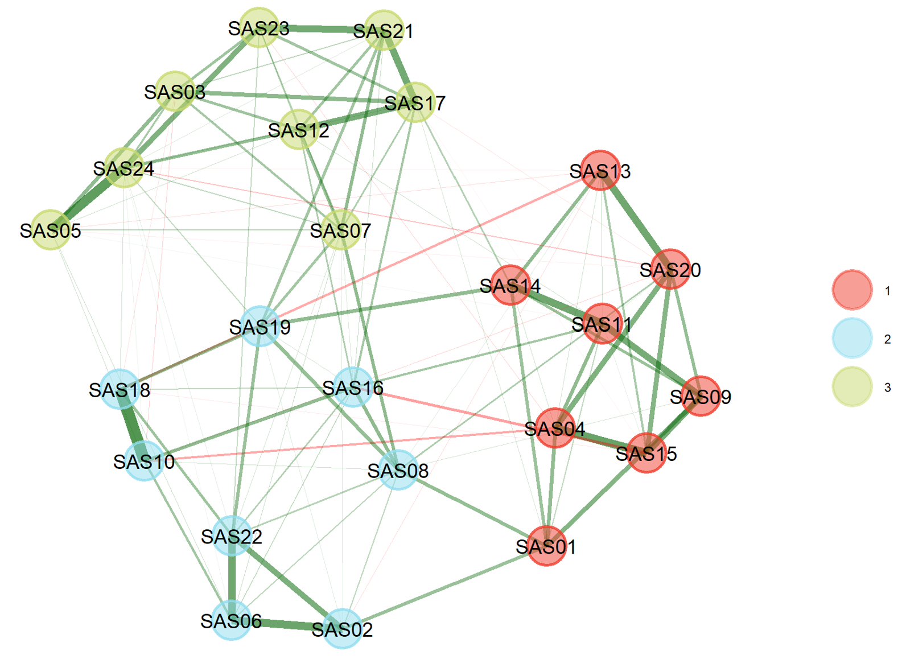
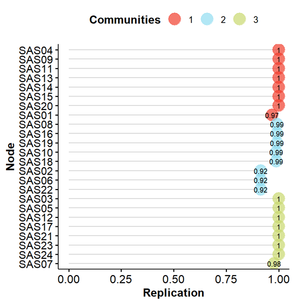
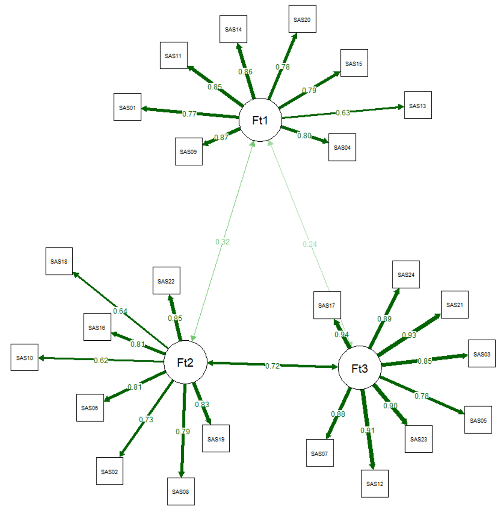
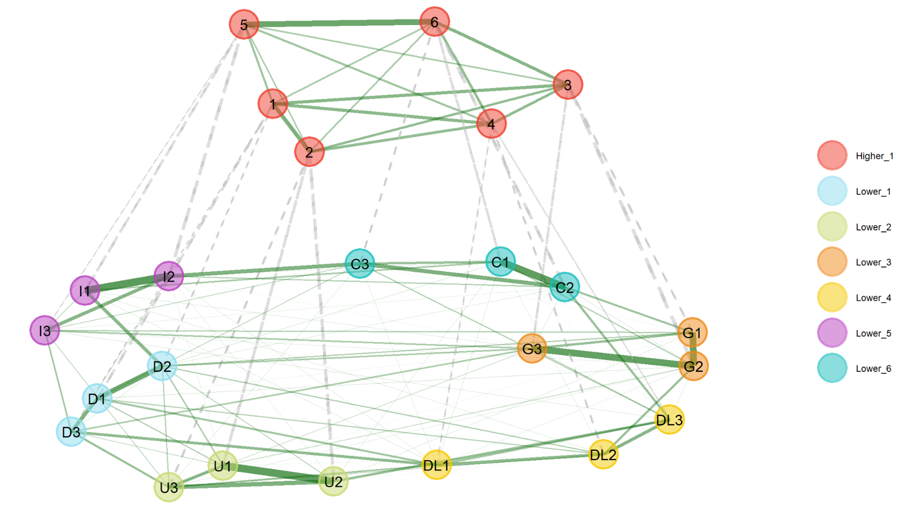
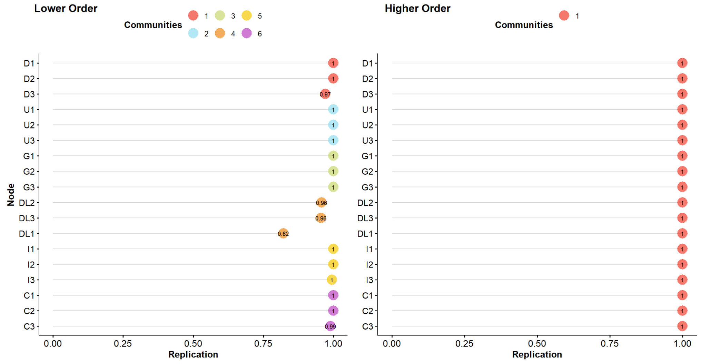
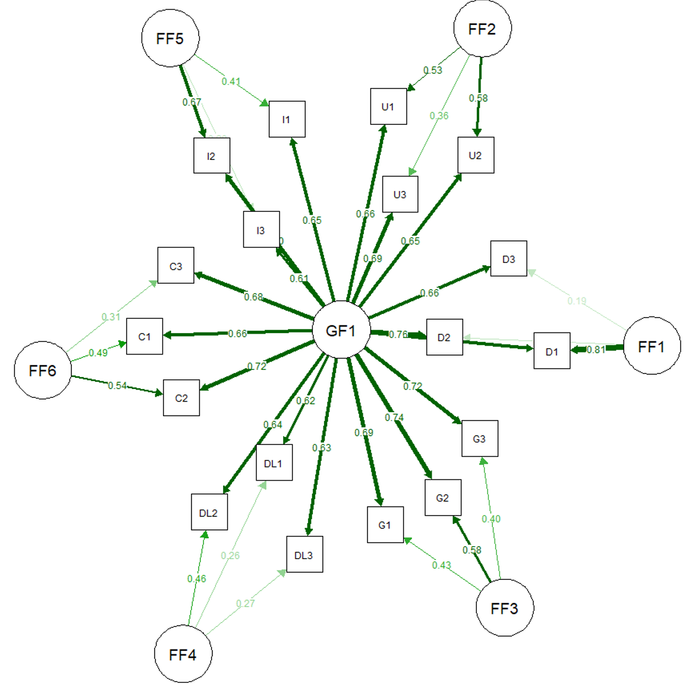
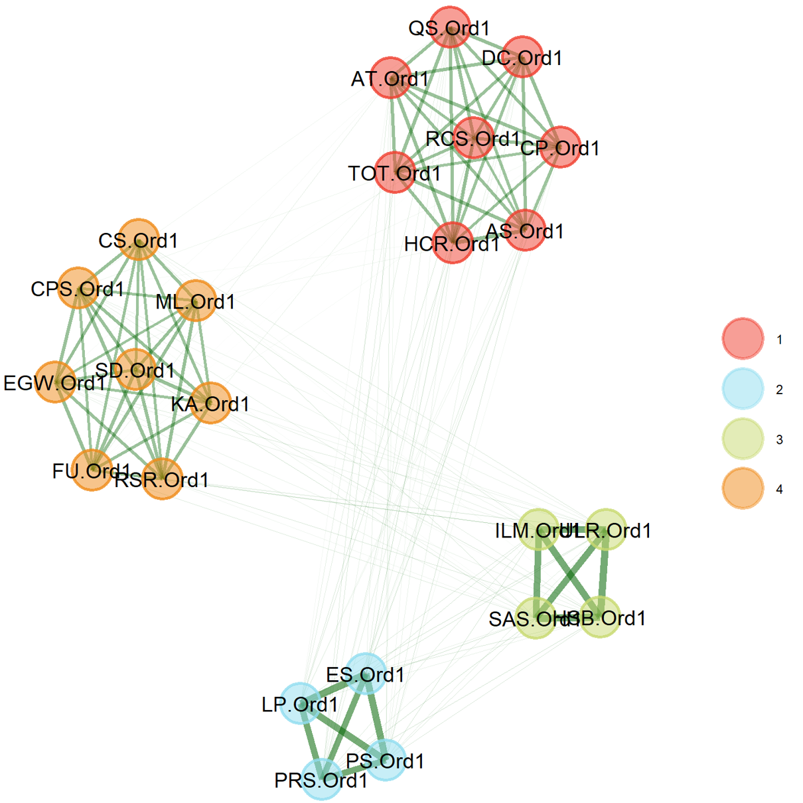
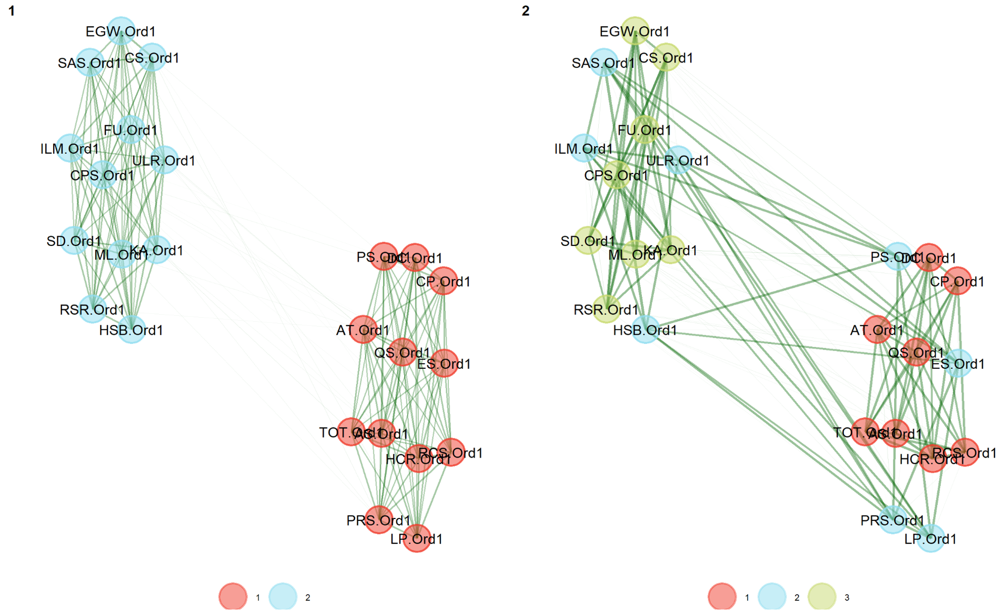
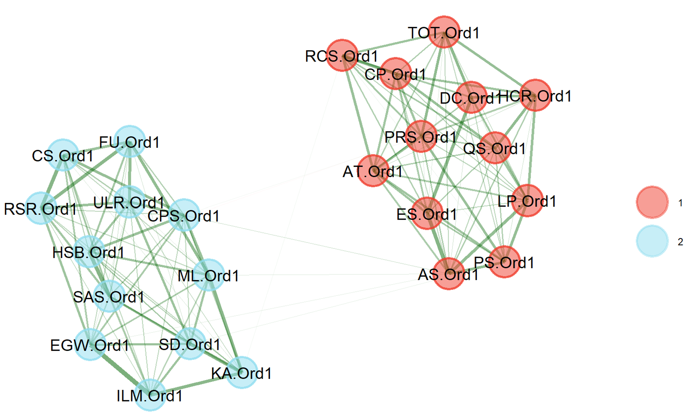
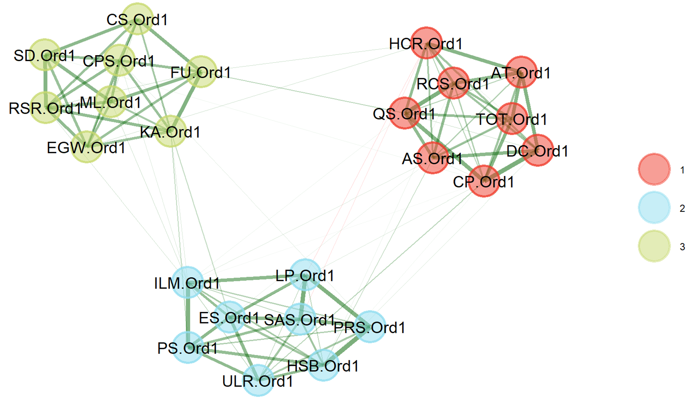

## Introduction

The network psychometrics approach offers a novel perspective to analyze a complex system of elements that are related to learning [@borsboom2021]. This approach to psychometrics is a helpful addition that complements the traditional factor analytic approach to study the interplay of psychological components consisting of a group as latent variables, such as cognitive ability, engagement, and motivation [@christensen2019]. Specifically, the factor analytic approach focuses on simplifying the relationships between such components as a restricted, factorial structure of observed and latent variables, while the network approach focuses on exploring unrestricted, dynamic associations among observed variables [@christensen2019;@hilpert2018;@guyon2017]. However, the network psychometrics approach conceptualizes the structure of a psychological network as a system with structural relationships between variables of interest [@borsboom2021].

Unlike the traditional factor analytic approach, the network psychometrics method operates without the assumption of latent factors. In this framework, items are permitted to demonstrate their associations by freely moving within a two-dimensional space [@borsboom2021]. If the items are related, they tend to naturally cluster together without the imposition of structural constraints [@borsboom2021; @network2022]. This characteristic offers researchers a novel perspective for examining the relationships between variables that constitute educational constructs as a system. Building upon the comprehensive introduction to psychological network estimation presented in the first volume of this book [@saqr2024], this chapter extends that discussion by exploring advanced applications of psychological networks through the exploratory graph analysis (EGA) method through the `EGAnet` package [@golino2022] in R [@rcoreteam2022].

Specifically, we describe and demonstrate methods to assess the integrity of such a network system with EGA and hierarchical EGA [@golino2022; @golino2017]. We also demonstrate the transformation of network structures from the EGA and Hierarchical EGA methods to the confirmatory factor analysis (CFA) format, highlighting how these approaches, despite operating differently, are comparable and can complement each other in examining the complex structure of a learning system [@golino2017]. Subsequently, we demonstrate how the dynamic EGA method allows researchers to assess changes in the structure of a system across multiple units of assessment [@golino2022]. This capability proves beneficial in scenarios involving the personalization of interventions for specific groups of learners [@koopmans2020]. Finally, we demonstrate the application of unique variable analysis (UVA) to identify variables that do not contribute meaningfully to the construct due to their redundancy (e.g., more than one variables that measure similar or the same attribute), thereby reducing them to simplify the dataset for better model fit [@christensen2023].

## Literature Review

### Examining A System of Educational Variable with EGA

EGA is a network psychometrics technique that leverages graphical network estimation and community detection algorithms to elucidate the complex structure of educational data [@golino2022]. Like other network domain methods, EGA represents observed variables as nodes and their partial correlations as edges within the network [@christensen2021]. Clusters of variables in an EGA analysis depict their underlying latent structure, encompassing the observed variables themselves [@golino2017]. These clusters, called communities, allow researchers to examine hidden structures that may not be available upon mere observation.

A distinctive characteristic of EGA is its use of community detection algorithms, such as "Louvain" or "Walktrap." These algorithms optimize the identified structure of the psychological system under investigation, offering researchers a novel approach to estimating the structure of a psychological construct [@golino2022]. For instance, the Louvain algorithm identifies clusters of observed variables based on a multi-level modularity optimization algorithm [@blondel2008], while the Walktrap method employs a random walk algorithm [@pons2006].

Beyond a single estimation of the network structure, EGA offers the capability to assess its stability across data variations through iterations of bootstrap resampling [@christensen2021]. This iterative approach, known as BootEGA, estimates the network structure by identifying the median structure across all results from the bootstrap iterations [@golino2022]. This approach enhances the robustness of network structure assessment by accounting for potential uncertainties arising from dataset variations.

Furthermore, the EGA method can estimate network structures with nodes that share common covariance, potentially representing hierarchical information like higher-order constructs [@christensen2019]. This ability allows EGA to capture the hierarchical nature of variables without requiring manual input from researchers. Additionally, EGA can estimate dynamic communities in multivariate time series data at various units of measurement (i.e., intra-individual structure, groups, and inter-individual structure). This method, termed dynamical EGA, allows researchers to examine changes in the network structure across sub-populations [@golino2022]. Such insights can inform the development of personalized interventions in variables that change across groups, such as students’ feedback utilization between low achievers and high achievers.

Regarding reporting metrics, both EGA and Hierarchical EGA show a network plot depicting the community assignment of each item alongside the same model fit indices used in Confirmatory Factor Analysis (CFA). Specifically, an EGA object can provide absolute fit indices such as Root Mean Square Error of Approximation (RMSEA) and Standardized Root Mean Square Residual (SRMR), which are recommended to be less than 0.05 and 0.08, respectively, to indicate a good fit [@finch2019; @hu1999]. Additionally, relative fit indices such as the Comparative Fit Index (CFI) and Tucker-Lewis Index (TLI) are available. These indices should ideally be 0.95 or higher [@hu1999]. The extraction of CFA fit from EGA can be done by transforming an EGA or Hierarchical EGA object into a CFA through the `CFA` function in the `EGAnet` package [@golino2022]. Then, the fit measures can be extracted through the `fitmeasures` function from the `lavaan` package [@rosseel2012].

Bootstrap EGA yields results similar to EGA, with the added benefit of providing the typical structure represented by the median dimensions identified across multiple network structures from bootstrap iterations [@golino2017]. It also offers information on the replication proportion for item-level results and structural consistency indices for dimension-level results [@christensen2021; @golino2017]. Notably, the EGA method introduces a unique relative fit index known as the Total Entropy Fit Index (TEFI) that complements conventional fit indices [@golino2021]. A lower TEFI value indicates reduced disorder and uncertainty in the estimated structure, signifying greater robustness in item organization [@golino2021]. The CFA fit metrics, however, are not available in the dynamical EGA method. Instead, it has network fit information such as the number of communities, the median dimension for the intra-individual level, and TEFI at the group and inter-individual levels [@golino2022].

A use-case of EGA in learning analytics could be the prediction of students’ success to inform instructors’ teaching strategies. The instructor could collect learning-related data such as attendance, participation in class discussions, time spent on homework, use of learning resources, and scores on quizzes and exams. Through the community detection algorithms of EGA, clusters of these variables are formed, representing their underlying latent structure. For instance, attendance and participation in class discussions might form one community, indicating that these two factors are closely related and might contribute to a latent factor such as ‘class engagement.’ Similarly, time spent on homework and use of learning resources might form another community, possibly representing a latent factor like ‘study habits’. This information can then be used to develop targeted interventions to improve student outcomes. For example, if ‘class engagement’ is identified as a key factor in student success, the university might implement strategies to increase student participation in class discussions. In this way, EGA serves as a powerful tool for educational institutions to analyze complex educational data and uncover meaningful insights that can inform decision-making and strategy development. It allows researchers to go beyond mere observation and examine the hidden structures within their data. This can lead to more effective interventions and improved educational outcomes.

### Reducing Redundant Variables with UVA

Being developed under the same R package as EGA, UVA employs network estimation to identify redundant nodes or variables for removal [@christensen2023]. These redundant nodes, if left unchecked, could give rise to undesired clusters that impede the interpretability of the estimated structure of the dataset [@christensen2023; @leising]. In learning analytics, network analysis can be used to understand student interactions and learning patterns. Data from a learning management system on students (e.g., ID, enrollment information, demographic), courses (e.g., course ID, topics, difficulty level), activities (e.g., login information, forum discussions, quiz attempts, assignment submissions), and grades (e.g., formative assessment score, assignments, and final exams) can be transformed into a network structure.

However, this network might contain redundant nodes. For example, a student submitting an assignment likely logged in around that time. These two nodes ("assignment submission" and "login") might be capturing overlapping information. Keeping these redundant nodes can lead to misleading clusters, like grouping logins and submissions together. Techniques like UVA, which identifies and removes redundant nodes, can help create a clearer picture. This allows the analysis to focus on meaningful connections, such as discussion participation and its relation to assignment performance to improve the course design. Functionally, the UVA method leverages two algorithms to assess the similarity between network nodes based on partial correlation. These algorithms are the graphical least absolute shrinkage and selection operator (GLASSO) and the weighted Topological Overlap (wTO) [@christensen2023; @nowick2009].

The UVA method employs wTO to identify neighboring nodes that share connections with a particular pair of nodes [@gysi2018]. Essentially, nodes with highly similar connections to the same set of neighboring nodes are considered redundant [@gysi2018]. In simpler terms, wTO detects highly correlated nodes that exhibit similar relationships with other nodes in the network, suggesting a level of interdependence [@christensen2023]. For instance, if "class participation" and "student engagement" share strong connections with variables like "student satisfaction" and "dropout rates," they might be considered a redundant pair.

The integration of wTO with GLASSO network estimation allows for the visualization of potential interactions between nodes, the extent of overlap in connections between specific nodes, and the overall commonality of nodes within the entire network [@nowick2009]. Following the identification of redundant nodes, the UVA method offers various strategies for their management.

Redundant nodes can be:

1.  Merged into latent variables using CFA [@golino2022; @rhemtulla2012];

2.  Removed from the dataset entirely;

3.  Aggregated by summing their scores across all cases. Furthermore, UVA can perform additional computations to detect any remaining redundancy after the initial reduction.

UVA possesses two key metrics for reporting: 1) the degree of redundancy for each node, as indicated by wTO and 2) the identification of latent variables encompassing redundant nodes [@golino2022]. Regarding effectiveness, @christensen2023 demonstrated that UVA surpasses existing methods in detecting local dependencies between variables. These methods include exploratory structural equation modeling [@asparouhov2009], anti-image partial correlations [@ferrando2022], and expected residual correlation direct change [@saris2009].

## Tutorial with R

We start by installing the following packages: `EGAnet` [@golino2022], `haven` [@wickham2023], and `lavaan` [@rosseel2012]. In our code, we use the double colon (`::`) notation to explicitly indicate the package from which each function originates. This practice ensures clarity for readers who may want to utilize specific functions from the tutorial. By specifying the package, we eliminate the need for readers to trace the source of each function.

```{r, message = FALSE, error = FALSE, warning = FALSE, eval = FALSE}
#install.packages(c("EGAnet", "haven", "lavaan"))

library(EGAnet)
library(haven)
library(lavaan)
```
```{r, echo = FALSE}
load("LAMethod_EGA.RData")
```

In this chapter, we utilize student response data from the Statistical Anxiety Scale (SAS) to illustrate the ordinary EGA task and data from the Statistical Anxiety Rating Scale (STARS) to demonstrate the UVA task. The SAS dataset consists of 24 items, which is a manageable size for comprehensive examination and visualization using EGA [@chiesi2011]. Conversely, the STARS includes 51 items, which allows for the identification of potential redundant items [@chew2018]. Both datasets are derived from the study by @chew2018 and can be accessed via <https://doi.org/10.6084/m9.figshare.5544883.v2>.

The Hierarchical EGA task is illustrated using a synthesized dataset based on student responses to the Student Perspective of Teaching (SPOT) survey, a course evaluation tool employed by a Western Canadian university. The SPOT survey encompasses six dimensions that collectively measure the construct of teaching effectiveness; These dimensions are as follows: 1) course organization, 2) usefulness of course resources, 3) graded work, 4) course delivery, 5) instructional approach, and 6) class climate [@bulut2024]. This characteristic enables the assessment of the hierarchical structure within the SPOT dataset. This dataset is related to the learning context as students' feedback on courses is a vital component of information for enhancing teaching strategies.

Finally, the dynamic EGA task is demonstrated using a simulated dataset from the EGAnet package. Due to the specificity and limited public availability of multivariate time series data with repeated measures, a simulated dataset is employed for this purpose.

### Examining Structure of an Educational Assessment with EGA

#### Ordinary EGA

For the EGA task, we begin by loading the dataset from @chew2018 into our R environment using the `read_sav()` function. Subsequently, we extract the students' responses to the SAS. The command `df[, 56:79]` is employed to subset the data frame, including columns 56 to 79, which correspond to the SAS items.

```{r, message = FALSE, error = FALSE, warning = FALSE, eval = FALSE}
df <- read_sav(url(
  "https://github.com/lamethods/data2/raw/refs/heads/main/anxiety/STARS.sav"))

df_sas <- df[,56:79]
```

Subsequently, we perform EGA on the SAS dataset using the Louvain algorithm and the graphical LASSO model. The correlation method is set to auto-detection, allowing the analysis to determine the appropriate correlations for the data: Pearson's for continuous data, polychoric for ordinal data, tetrachoric for binary data, and polyserial/biserial for ordinal/binary data with continuous data. The analysis iterates 1000 times to achieve consensus using the highest modularity method. The network is then plotted, and the process is seeded for reproducibility. The EGA results can be accessed by calling the EGA object created during the analysis.

```{r, message = FALSE, error = FALSE, warning = FALSE, eval = FALSE}
sas_ega <- EGAnet::EGA(
  data = df_sas, 
  algorithm = "louvain", 
  model = "glasso",
  corr = "auto",
  consensus.iter = 1000,
  consensus.method = c("highest_modularity"),
  plot.EGA = TRUE,
  seed = 1234
)
```

**Output** 1. EGA Output of the SAS Dataset

```{r, message = FALSE, error = FALSE, warning = FALSE}
sas_ega
```

```{r, message = FALSE, error = FALSE, warning = FALSE, eval = FALSE}
sas_ega$plot.EGA #plot the EGA network graph
```

{#fig-1}

@fig-1 shows that items in the SAS dataset can be allocated into three communities, as color-coded by the red, blue, and green colors. Output 1 provides information about the network structure of the SAS dataset after 1000 iterations of network estimation. According to the output, items loaded onto community 1 are SAS items 1, 4, 9, 11, 13, 14, 15, and 20. Items loaded onto community 2 are SAS items 2, 6, 8, 10, 16, 18, 19, and 22. Items loaded onto community 3 are SAS items 3, 5, 7, 12, 17, 21, 23, and 24. The output indicates that the network structure is not unidimensional, as multiple communities are present. The SAS network structure has a TEFI of -28.094, which serves as a relative fit index. This index can be used to compare the structural uncertainty of this network with other similar network structures, whether estimated by different methods or after item removal.

Beyond a single estimation of the network structure, we can assess the dimensional stability of the SAS network structure across different variations of the dataset using bootstrap EGA. This can be performed with the `EGAnet::bootEGA()` function. We conduct 600 parametric iterations using the Walktrap algorithm and the graphical LASSO model. The typical structure is plotted, and the process utilizes seven cores for parallel computation with progress tracking. The `summary()` function is then used to obtain a summary of the bootstrapped EGA results.

```{r, message = FALSE, error = FALSE, warning = FALSE, eval = FALSE}
sas_BOOTega <- EGAnet::bootEGA(
  data = df_sas, 
  cor = "cor_auto",
  uni.method = "louvain",
  iter = 600,
  type = "parametric", 
  EGA.type = "EGA", 
  model = "glasso", 
  algorithm = "walktrap",
  consensus.method = "highest_modularity", 
  typicalStructure = TRUE,
  plot.typicalStructure = TRUE,
  ncores = 7,
  progress = TRUE,
  summary.table = TRUE,
  seed = 1234
)
```

**Output** 2. Bootstrap EGA Output of the SAS Dataset

```{r, message = FALSE, error = FALSE, warning = FALSE}
summary(sas_BOOTega)
```

Output 2 presents a summary of the bootstrap EGA results. Across 600 iterations of bootstrap resampling, the results indicate that a three-dimensional structure was identified in 90.17% of the bootstrap samples, suggesting a high likelihood that the data can be best described by three distinct dimensions. A four-dimensional structure was found in 9.67% of the samples, while a five-dimensional structure appeared in only 0.17% of the samples, indicating that these structures are less stable and less likely to represent the true underlying structure based on the utilized dataset. The median number of dimensions across the bootstrap samples is 3, with a 95% confidence interval ranging from 2.4 to 3.6. This further supports the stability of the three-dimensional structure as the most likely representation of the data.

Next, we utilize the `EGAnet::dimensionStability()` function to analyze the stability of dimensions and items in the bootstrapped EGA results.

```{r, message = FALSE, error = FALSE, warning = FALSE, eval = FALSE}
dim_stability_sas <- EGAnet::dimensionStability(sas_BOOTega)
dim_stability_sas
```

**Output** 3. Dimensional Stability Output of the SAS Dataset

```{r, message = FALSE, error = FALSE, warning = FALSE, eval = FALSE}
> dim_stability_sas
EGA Type: EGA 
Bootstrap Samples: 600 (Parametric)
Proportion Replicated in Dimensions:
    SAS01     SAS02     SAS03     SAS04     SAS05     SAS06     SAS07     SAS08     SAS09     SAS10 
0.9683333 0.9150000 1.0000000 1.0000000 1.0000000 0.9150000 0.9783333 0.9916667 1.0000000 0.9883333 
    SAS11     SAS12     SAS13     SAS14     SAS15     SAS16     SAS17     SAS18     SAS19     SAS20 
1.0000000 1.0000000 1.0000000 1.0000000 1.0000000 0.9916667 1.0000000 0.9883333 0.9916667 1.0000000 
    SAS21     SAS22     SAS23     SAS24 
1.0000000 0.9150000 1.0000000 1.0000000 
----
Structural Consistency:
        1         2         3 
0.9683333 0.9016667 0.9783333 
```

{#fig-2}

Output 3 and Figure 2 present the structural stability results of the SAS dataset. The output shows the replication proportion of each item in the three-dimensional model of the SAS dataset. Most items have a replication proportion of 1.00, indicating that they are consistently loaded onto their respective dimensions 100% of the time across all bootstrap iterations. A few variables have slightly lower proportions, such as SAS items 2, 6, and 22, each with a proportion of 0.915, and SAS item 1 with 0.968. The structural consistency results, which represent the proportion of times that each empirical EGA dimension exactly replicates across the bootEGA samples, indicate that the identified dimensions are highly consistent. Dimension 3 is the most stable, with a consistency of 0.978, followed closely by Dimension 1 at 0.968. Dimension 2, while slightly lower in stability, still shows a high consistency at 0.902.

Overall, the dimensional stability results demonstrate that the dimensions identified in the SAS dataset are highly stable and consistent across the bootstrap samples. The high replication proportions and structural consistency values suggest that the dimensional structure is robust, with most variables consistently assigned to the same dimensions across different bootstrap samples. This indicates a robust and reliable factor structure in the data.

After obtaining the network structure of the SAS dataset through EGA, we can transform the EGA object into a CFA object using the `CFA` function. Subsequently, we can extract the CFA fit indices of the three-dimensional structure of the SAS dataset using the `fitmeasures` function as follows:

```{r, message = FALSE, error = FALSE, warning = FALSE, eval = FALSE}
sas_ega_cfa <- EGAnet::CFA(ega.obj = sas_ega, estimator = "WLSMV",
                            plot.CFA = FALSE,
                            data = df_sas)
```

{#fig-3}

**Output** 4. CFA Model Specification and Fit Indices of the SAS Dataset

```{r, message = FALSE, error = FALSE, warning = FALSE}
sas_ega_cfa

lavaan::fitMeasures(sas_ega_cfa$fit, fit.measures = c("chisq", "df", "pvalue", "cfi", "tli", "rmsea", "srmr"))
```

Output 4 shows the specification of the CFA model. It defines three latent factors (Fat 1, Fat 2, Fat 3) and their corresponding observed variables (e.g., SAS01, SAS04, etc.). This specification is visualized in Figure 3. The fit summary (`$fit`) shows the following information: Estimator: DWLS (Diagonally Weighted Least Squares), suitable for ordinal data. Optimization method: NLMINB, an algorithm used for optimization. Number of model parameters: 123 parameters were estimated in the model. Number of observations: 202 participants in the dataset. Number of missing patterns: 1, meaning that there is only 1 datapoint missing. The model demonstrates a good fit according to the CFI and TLI, both of which are above 0.95. However, it shows a poor fit according to the RMSEA (\> 0.1) and the SRMR (\> 0.8). The significant chi-square test (p \< .001) suggests that the model's covariance structure significantly differs from the observed covariance structure, which may be due to the large sample size or model complexity.

#### Hierarchical EGA

For the Hierarchical EGA task, we start by loading the synthesized SPOT dataset [@bulut2024] into our R environment by loading the accompanying R object of this chapter as follows:

```{r, message = FALSE, error = FALSE, warning = FALSE, eval = FALSE}
load("LAMethod_EGA.RData")
```

Next, similarly to the previous EGA section, we performed hierarchical EGA on the synthetic SPOT data using the Louvain algorithm and graphical LASSO model. The correlation method was set to auto-detection, allowing the analysis to determine the appropriate correlations: Pearson's for continuous data, polychoric for ordinal data, tetrachoric for binary data, and polyserial / biserial for ordinal / binary data with continuous data. The analysis iterated 1000 times to achieve consensus using the highest modularity method. The network was plotted, and the process was seeded for reproducibility. The hierarchical EGA results can be accessed by calling the hierarchical EGA object created during the analysis.

```{r, message = FALSE, error = FALSE, warning = FALSE, eval = FALSE}
spot_Hierega <- EGAnet::hierEGA(
  data = spot_synth, 
  algorithm = "louvain", 
  model = "glasso",
  corr = "auto",
  consensus.iter = 1000,
  consensus.method = c("highest_modularity"),
  plot.EGA = TRUE,
  seed = 1234
)
```

**Output** 5. Hierarchical EGA Output of the SPOT Dataset

```{r, message = FALSE, error = FALSE, warning = FALSE}
spot_Hierega
```

```{r, message = FALSE, error = FALSE, warning = FALSE, eval = FALSE}
spot_Hierega$plot.hierEGA
```

{#fig-4}

Output 5 and Figure 4 present results from the hierarchical EGA of the SPOT dataset using the GLASSO method applied at both lower and higher orders of the SPOT structure. For the lower-order analysis, the algorithm uses the Louvain algorithm for community detection over 1000 iterations. The algorithm identifies six communities, each comprising three variables (e.g., D1, D2, and D3 form one community). The analysis indicates the lower-order network has a TEFI of 4.48. For the higher-order analysis, the algorithm also uses the Louvain algorithm for community detection. A single community encompassing all six variables (i.e., six lower-order dimensions) was identified, indicating the network is unidimensional. The TEFI for this higher-order structure is -26.591, with a generalized TEFI of -22.111. Comparing the TEFI values, the higher-order (bifactor) structure demonstrates a better fit (-26.591) than the correlated lower-order factor structure (4.48), suggesting a single underlying dimension more effectively explains the data structure.

Next, we can assess the stability of the SPOT hierarchical network structure across different datasets using bootstrap hierarchical EGA, similar to the ordinary EGA method. This can be achieved as follows:

```{r, message = FALSE, error = FALSE, warning = FALSE, eval = FALSE}
spot_BOOTega <- EGAnet::bootEGA(
  # we could also provide the cor matrix but then
  # n (i.e., number of rows) must also be specified
  data = spot_synth, 
  cor = "cor_auto",
  uni.method = "louvain",
  iter = 600, # Number of replica samples to generate
  # resampling" for n random subsamples of the original data
  # parametric" for n synthetic samples from multivariate normal dist.
  type = "parametric", 
  # EGA Uses standard exploratory graph analysis
  # EGA.fit Uses total entropy fit index (tefi) to determine best fit of EGA
  # hierEGA Uses hierarchical exploratory graph analysis
  EGA.type = "hierEGA", 
  model = "glasso", 
  algorithm = "walktrap", # or "louvain" (better for unidimensional structures)
  # use "highest_modularity", "most_common", or "lowest_tefi"
  consensus.method = "highest_modularity", 
  typicalStructure = TRUE, # typical network of partial correlations
  plot.typicalStructure = TRUE, # returns a plot of the typical network
  ncores = 7,
  progress = TRUE ,
  summary.table	= TRUE,
  seed = 1234
)
```

**Output** 6. Bootstrap hierarchical EGA Output of the SPOT Dataset

```{r, message = FALSE, error = FALSE, warning = FALSE}
summary(spot_BOOTega)
```

Output 6 shows the results of the bootstrap hierarchical EGA with the SPOT dataset. Across 600 iterations of bootstrap resampling, bootstrap hierarchical EGA found that the median structure of the SPOT dataset at the lower level has six communities, with a 94% frequency of structural replication. In other words, the BootEGA algorithm was able to replicate the six-dimensional structure 94% of the time, the five-dimensional structure 4% of the time, and the seven-dimensional structure 2% of the time across all bootstrap iterations. For the higher-order analysis, bootstrap hierarchical EGA found that the higher-order network is consistently unidimensional across all bootstrap samples, with a frequency of 1, indicating that a single dimension was found in 100% of the bootstrap samples. The median number of dimensions is also one. Overall, the results suggest that while the lower-order analysis identifies multiple distinct communities (dimensions) within the data, the higher-order analysis indicates that these lower-order dimensions can be explained by a single overarching dimension. This hierarchical structure suggests a complex data structure at the lower level, simplified by a single factor at the higher level.

The `EGAnet::dimensionStability` function can also be applied to the hierarchical EGA object to analyze the stability of measurement dimensions and items.

```{r, message = FALSE, error = FALSE, warning = FALSE, eval = FALSE}
dim_stability_spot <- EGAnet::dimensionStability(spot_BOOTega)
dim_stability_spot
```

**Output** 7. Dimensional Stability Output of the SPOT Dataset

```{r, message = FALSE, error = FALSE, warning = FALSE, eval = FALSE}
> dim_stability_spot
EGA Type: hierEGA 
Bootstrap Samples: 600 (Parametric)

Proportion Replicated in Dimensions:

       D1 D2        D3 U1 U2 U3 G1 G2 G3       DL1       DL2       DL3 I1 I2    I3 C1 C2   C3
Lower   1  1 0.9716667  1  1  1  1  1  1 0.8216667 0.9583333 0.9566667  1  1 0.995  1  1 0.99
Higher  1  1 1.0000000  1  1  1  1  1  1 1.0000000 1.0000000 1.0000000  1  1 1.000  1  1 1.00
----
Structural Consistency:
Lower Order
        1         2         3         4         5         6 
0.9716667 1.0000000 1.0000000 0.8200000 0.9950000 0.9900000 

Higher Order
1 
1 
```

{#fig-5}

Output 7 and Figure 5 show the structural stability results of the SPOT dataset. The output shows the replication proportion of each item in the six-dimension model of the SPOT dataset. The analysis shows that for the lower-order dimensions, most variables were consistently replicated with proportions close to or at 1, indicating high consistency. Specifically, variables D1, D2, U1, U2, U3, G1, G2, G3, I1, I2, C1, and C2 each had a replication proportion of 1. Variables D3, DL1, DL2, DL3, I3, and C3 had slightly lower proportions, ranging from approximately 0.822 to 0.995, indicating high but not perfect consistency. In the higher-order analysis, all variables were perfectly replicated within the single identified dimension, with proportions of 1, demonstrating complete consistency.

In terms of structural consistency, the lower-order dimensions showed high stability, with values indicating near-perfect stability for Dimensions 1, 4, and 6 and perfect stability for Dimensions 2, 3, and 5. The higher-order analysis revealed perfect structural consistency with a value of 1, indicating that the single higher-order dimension is entirely stable across bootstrap samples. Overall, the analysis highlights the robust higher-order structure that simplifies the complex relationships observed in the lower-order dimensions, with minor variability in the lower-order dimensions suggesting slight but non-critical instability.

Similarly to the EGA demonstration, the hierarchical EGA object can also be transformed into a CFA object and extract CFA fit measures with the following codes:

```{r, message = FALSE, error = FALSE, warning = FALSE, eval = FALSE}
spot_ega_cfa <- EGAnet::CFA(ega.obj = spot_Hierega, estimator = "WLSMV", plot.CFA = FALSE, data = spot_synth)
```

**Output** 8. CFA Model Specification and Fit Indices of the SPOT Dataset

```{r, message = FALSE, error = FALSE, warning = FALSE}
spot_ega_cfa
lavaan::fitMeasures(spot_ega_cfa$fit, fit.measures = c("chisq", "df", "pvalue", "cfi", "tli", "rmsea", "srmr"))
```

{#fig-6}

Output 8 shows the specification of the SPOT CFA model. The model specifies six first-order factors, each measured by three observed variables and one second-order factor indicated by all the observed variables from the first-order factors. This specification is visualized in Figure 6. The analysis used the DWLS estimator and converged normally after 57 iterations, estimating 108 parameters from 695 observations with 15 points of missing data. The model has a good fit according to the CFI and TLI (both need to be \> 0.95), RMSEA (\< 0.5), and SRMR (\< 0.8). The significant chi-square test (p-value \< .001) suggests that the model's covariance structure significantly differs from the observed covariance structure, which might be due to the large sample size or model complexity.

#### Dynamic EGA

In addition to assessing the static structure of a dataset, the dynamic EGA method can be utilized to examine changes in the structure of a variable system across multiple units of assessment, such as population, group, and individual cases. This task is demonstrated through the `dynEGA` function in the `EGAnet` package [@golino2022]. As previously mentioned, we utilize a built-in simulated dataset from the `EGAnet` package due to the limited availability of multivariate time series data with repeated measures in the educational context. We begin by loading and examining the dataset as follows:

```{r, message = FALSE, error = FALSE, warning = FALSE}
data("sim.dynEGA")
str(sim.dynEGA)
```

To contextualize the variables and the network structure, we assign educational names to each variable. This can be achieved using the following codes:

```{r, message = FALSE, error = FALSE, warning = FALSE}
# Define the new column abbreviations
new_column_names <- c(
  "TOT",  # Time on Task
  "QS",   # Quiz Scores
  "AS",   # Assignment Scores
  "CP",   # Class Participation
  "AT",   # Attendance
  "DC",   # Discussion Contributions
  "RCS",  # Reading Comprehension Scores
  "HCR",  # Homework Completion Rate
  "PS",   # Project Scores
  "LP",   # Lab Performance
  "ES",   # Exam Scores
  "PRS",  # Peer Review Scores
  "SAS",  # Self-Assessment Scores
  "ILM",  # Interaction with Learning Materials
  "ULR",  # Use of Learning Resources
  "HSB",  # Help-Seeking Behavior
  "ML",   # Motivation Levels
  "EGW",  # Engagement in Group Work
  "RSR",  # Reflection and Self-Regulation
  "KA",   # Knowledge Application
  "SD",   # Skill Development
  "FU",   # Feedback Utilization
  "CS",   # Communication Skills
  "CPS",   # Creativity in Problem Solving
  "ID", #ID
  "Group" #Group
)
```

The meaning of each variable is outlined in @tbl-1. The dataset has 24 variables in total, with one column for respondent ID and another column for group information of each respondent.

| Variable Code | Variable Name | Variable Description |
|------------------------|------------------------|------------------------|
| TOT | Time on Task | The amount of time spent on a particular task or activity. |
| QS | Quiz Scores | The scores obtained on quizzes. |
| AS | Assignment Scores | The scores obtained on assignments. |
| CP | Class Participation | The level of participation in class activities. |
| AT | Attendance | The frequency of attendance in classes or sessions. |
| DC | Discussion Contributions | The number of contributions made in discussion forums. |
| RCS | Reading Comprehension Scores | The scores obtained on reading comprehension tests. |
| HCR | Homework Completion Rate | The rate at which homework is completed. |
| PS | Project Scores | The scores obtained on projects. |
| LP | Lab Performance | The performance in laboratory exercises or practicals. |
| ES | Exam Scores | The scores obtained in exams. |
| PRS | Peer Review Scores | The scores given by peers in peer-reviewed activities. |
| SAS | Self-Assessment Scores | The scores from self-assessment activities. |
| ILM | Interaction with Learning Materials | The frequency or quality of interaction with learning materials. |
| ULR | Use of Learning Resources | The extent of use of additional learning resources. |
| HSB | Help-Seeking Behavior | The frequency of seeking help from instructors or peers. |
| ML | Motivation Levels | The levels of motivation towards the learning activities. |
| EGW | Engagement in Group Work | The level of engagement in group work or collaborative activities. |
| RSR | Reflection and Self-Regulation | The frequency and quality of reflective practices and self-regulation. |
| KA | Knowledge Application | The ability to apply knowledge in practical or real-world scenarios. |
| SD | Skill Development | The progress in skill development over time. |
| FU | Feedback Utilization | The extent to which feedback is utilized to improve performance. |
| CS | Communication Skills | The proficiency in communication skills within the learning context. |
| CPS | Creativity in Problem Solving | The level of creativity demonstrated in problem-solving activities. |

: List of Utilized Variables in the Dynamic EGA Task {#tbl-1}

After finishing processing the dataset, we can perform dynamic EGA on simulated data at individual, group, and population levels using the Louvain algorithm and Pearson correlation as follows:

```{r, message = FALSE, error = FALSE, warning = FALSE, eval = FALSE}
simulated_all <- dynEGA(
  data = sim.dynEGA,
  level = c("individual", "group", "population"),
  ncores = 6, # use more for quicker results
  verbose = TRUE, # progress bar
  corr = "pearson",
  algorithm = "louvain",
  id = "ID",
  group = "Group"
)

```

**Output** 9. Population-Level Dynamic EGA Output of the Simulated Data

```{r, message = FALSE, error = FALSE, warning = FALSE}
simulated_all$dynEGA$population
```

{#fig-7}

Output 9 and Figure 7 show the extraction of the dynamic EGA results at the population level. The analysis, conducted with Pearson correlations and a regularization parameter (lambda) of approximately 0.095, involves 24 variables (nodes) and 156 edges, resulting in an edge density of 0.565. The non-zero edge weights have a mean of 0.076, a standard deviation of 0.085, and range from 0.000 to 0.290, indicating various strengths of connections between the variables. Furthermore, the analysis identified four distinct communities within the network. The community assignments are as follows: `TOT.Ord1`, `QS.Ord1`, `AS.Ord1`, `CP.Ord1`, `AT.Ord1`, `DC.Ord1`, `RCS.Ord1`, and `HCR.Ord1` form Community 1; `PS.Ord1`, `LP.Ord1`, and `ES.Ord1` form Community 2; `SAS.Ord1`, `ILM.Ord1`, `ULR.Ord1`, and `HSB.Ord1` form Community 3; and `ML.Ord1`, `EGW.Ord1`, `RSR.Ord1`, `KA.Ord1`, `SD.Ord1`, `FU.Ord1`, `CS.Ord1`, and `CPS.Ord1` form Community 4. The population-level structure has TEFI = -19.086.

**Output** 10. Group-Level Dynamic EGA Output of the Simulated Data

```{r, message = FALSE, error = FALSE, warning = FALSE}
simulated_all$dynEGA$group$"1" #group 1

simulated_all$dynEGA$group$"2" #group2
```

{#fig-8}

Output 10 and Figure 8 show the extraction of the dynamic EGA results at the group level. For Group 1, with Pearson correlations and a regularization parameter (lambda) of approximately 0.095, the analysis includes 24 variables (nodes) and 153 edges, resulting in an edge density of 0.554. The non-zero edge weights have a mean of 0.078, a standard deviation of 0.031, and a range from 0.000 to 0.111. Community detection via the Louvain algorithm identified two distinct communities: the first community includes variables `TOT.Ord1` through `PRS.Ord1`, while the second community comprises variables `SAS.Ord1` through `CPS.Ord1`. The TEFI value of group 1 network structure is -28.646.

For Group 2, the analysis similarly uses Pearson correlations and a lambda of approximately 0.095, encompassing 24 nodes and 145 edges with an edge density of 0.525. The non-zero edge weights in this group have a mean of 0.082, a standard deviation of 0.067, and range from 0.000 to 0.167. The Louvain algorithm identified three communities: the first community includes variables `TOT.Ord1` through `RCS.Ord1`, the second community consists of variables `PS.Ord1` through `CPS.Ord1`, and the third community contains variables `ML.Ord1` through `CPS.Ord1`. The TEFI value of group 1 network structure is -27.93.

Overall, the `dynEGA` results for both groups reveal multidimensional network structures. Group 1 exhibits a slightly higher edge density, while Group 2 shows greater variability in edge weights and a slightly higher TEFI. This suggests that the three-dimensional structure of Group 2 may have a somewhat less stable network structure compared to the two-dimensional structure of Group 1.

**Output** 11. Individual-Level Dynamic EGA Output of the Simulated Data: Case 1

```{r, message = FALSE, error = FALSE, warning = FALSE}
#Individual whose network has two communities
simulated_all$dynEGA$individual$"1"
```

{#fig-9}

Output 11 and Figure 9 show the extraction of the dynamic EGA results at the individual -level, specifically for individual number 1 in the dataset. The analysis employs a regularization parameter (lambda) of approximately 0.098. The network consists of 24 variables (nodes) and 127 edges, resulting in an edge density of 0.460. The non-zero edge weights have a mean of 0.093, a standard deviation of 0.055, and a range from -0.001 to 0.262. Community detection using the Louvain algorithm identified two distinct communities. The first community includes variables `TOT.Ord1` through `PRS.Ord1`, while the second community comprises variables `SAS.Ord1` through `CPS.Ord1`. The two communities network of individual 1 has the TEFI value of -30.637.

**Output** 12. Individual-Level Dynamic EGA Output of the Simulated Data: Case 75

```{r, message = FALSE, error = FALSE, warning = FALSE}
#Individual whose network has three communities
simulated_all$dynEGA$individual$"75"
```

{#fig-10}

Output 12 and Figure 10 show the extraction of the dynamic EGA results at the individual level, specifically for individual number 75 in the dataset. The analysis employs a regularization parameter (lambda) of approximately 0.097. This individual's network comprises 24 variables (nodes) and 104 edges, leading to an edge density of 0.377. The non-zero edge weights have a mean of 0.113, a standard deviation of 0.074, and a range from -0.024 to 0.258. The Louvain algorithm identified three distinct communities. The first community includes variables `TOT.Ord1` through `PRS.Ord1`, the second community includes variables `SAS.Ord1` through `CPS.Ord1`, and the third community consists of variables `ML.Ord1` through `CPS.Ord1`. The three-community network has a TEFI value of -24.445.

In summary, the population-level analysis revealed a denser network with four communities, indicated by its highest edge density. In contrast, the group-level analyses showed variations in edge density and community structure: Group 1 exhibited two communities, whereas Group 2 had three. At the individual level, network structures were less dense and varied in the number of communities, reflecting individual differences in network connectivity and structure. Comparing the TEFI values across all units of measurement, the network structure of Case 1 appears to be the most robust (TEFI = -30.637), followed by Group 1 (TEFI = -28.646), Group 2 (TEFI = -27.93), Case 75 (TEFI = -24.445), and the population-level structure as relatively less stable (TEFI = -19.086). This variability may stem from Case 1 and Group 1 having only two communities, limiting the potential communities that can be loaded, whereas the population-level structure's four communities allow for more loading possibility loading across multiple communities, resulting in lower stability as indicated by its TEFI value.

#### Identifying Redundant Nodes with Unique Variable Analysis

In addition to examining the structure of a dataset, the `EGAnet` package can identify redundant nodes that do not contribute meaningfully to the network structure, thereby reducing complexity. The UVA method identifies redundant nodes for researchers to address. It includes actions such as computing latent variables using CFA when there are three or more redundant variables, calculating the mean of redundant variables, removing all but one variable from a set of redundant variables based on wTO, and computing the sum of redundant variables. This task is demonstrated using the `EGAnet::UVA` function on the STARS dataset [@chew2018]. We begin by loading and examining the dataset as follows:

```{r, message = FALSE, error = FALSE, warning = FALSE}
names(df_stars)
```

Next, we apply the UVA method to identify redundant variables and extract its results as follows:

```{r, message = FALSE, error = FALSE, warning = FALSE, eval = FALSE}
stars_uva <- EGAnet::UVA(
  data = df_stars,
  reduce.method = "remove")
```

**Output** 13. UVA Output of the STARS Dataset

```{r, message = FALSE, error = FALSE, warning = FALSE}
stars_uva
```

Output 13 shows results of the UVA analysis on the STARS dataset. The results are categorized into different levels of redundancy. Firstly, variable pairs with wTO greater than 0.30 indicate large-to-very large redundancy, such as between `STARS03` and `STARS16` with a wTO of 0.516. Similarly, pairs with wTO above 0.25 suggest moderate-to-large redundancy, including `STARS30` and `STARS32` at 0.340. Further, pairs with wTO exceeding 0.20 indicate small-to-moderate redundancy, such as `STARS19` and `STARS23` with a wTO of 0.230. Additionally, the analysis identifies which variables were retained and which were removed. Variables such as `STARS03`, `STARS06`, and `STARS32` were retained because they either have lower wTO values with others, while variables like `STARS01`, `STARS02`, and `STARS10` were removed because they have high wTO values with others, indicating they are redundant compared to variables in the keep list.

To examine the data set after removing or processing the identified redundant variables, we can use the following codes:

```{r, message = FALSE, error = FALSE, warning = FALSE}
head(stars_uva$reduced_data, 3) #call for the first three rows of the reduced dataset
```

To assess whether the removal of redundant variables improves the model fit, we can compare the CFA fit between the network structure of the original and the reduced STARS dataset. This can be accomplished as follows:

```{r, message = FALSE, error = FALSE, warning = FALSE, eval = FALSE}
#Perform EGA with the original STARS dataset
stars_ega <- EGA(data = df_stars)
stars_ega_cfa <- EGAnet::CFA(ega.obj = stars_ega, estimator = "WLSMV",
                            plot.CFA = FALSE,
                            data = df_stars)
stars_fitMeasure <- lavaan::fitMeasures(stars_ega_cfa$fit, fit.measures = c("chisq", "df", "pvalue", "cfi", "tli", "rmsea", "srmr"))

#Perform EGA with the reduced STARS dataset
stars_reduced_ega <- EGA(data = stars_uva$reduced_data)
stars_reduced_ega_cfa <- EGAnet::CFA(ega.obj = stars_reduced_ega, estimator = "WLSMV",
                            plot.CFA = FALSE,
                            data = stars_uva$reduced_data)

stars_uva_fitMeasure <- lavaan::fitMeasures(stars_reduced_ega_cfa$fit, fit.measures = c("chisq", "df", "pvalue", "cfi", "tli", "rmsea", "srmr"))
```

**Output** 14. Model Fit Indices of the Original and the Reduced STARS Dataset

```{r, message = FALSE, error = FALSE, warning = FALSE}
#compare fit
stars_fitMeasure
stars_uva_fitMeasure
```

Output 14 shows model fit indices of the network structure of both reduced and original STARS dataset, as produced by the EGA method. Both models show a statistically significant fit (p \< 0.001), which could be due to a large number of sample sizes. The original model has a CFI of 0.978 and a TLI of 0.977, both of which suggest a good fit as they are close to 1. However, the RMSEA of 0.093 (between 0.08 and 0.1 = marginal fit) and the SRMR of 0.092 (\> 0.08 = poor fit) are relatively high, suggesting some model misfit.

On the other hand, the reduced model has a CFI of 0.989 and a TLI of 0.989, both of which suggest a relatively better fit than the original model. Additionally, the RMSEA of 0.067 (between 0.08 and 0.08 = acceptable fit) and the SRMR of 0.075 (\< 0.08 = good fit) are lower, indicating a better fit to the data with less approximation error and better residuals. Overall, the reduced model demonstrates a superior fit compared to the original model, as evidenced by higher CFI and TLI values and lower RMSEA and SRMR values.

## Concluding Remarks

In the learning analytics environment, understanding the various variables that reflect students' learning as an interconnected system is essential. This chapter discusses the advanced application of the network psychometrics approach to understand such a complex system by visualizing them with the EGA method, as well as assessing the robustness of such structures with metrics such as dimension stability, CFA metrics, and TEFI. In other words, the advanced applications of psychological networks through EGA offer a robust framework for understanding the complex relationships between variables in educational assessments.

These demonstrated techniques allow researchers to identify key variables and their interactions, assess the stability and integrity of these systems, and monitor changes at different units of assessment (i.e., population, group, and individual). These methods yield insights into educational data, facilitating more informed decision-making and strategy development to enhance student learning outcomes.

The practical applications of these methods are diverse. Our SAS and SPOT analysis revealed highly stable dimensions of the instruments; these results can be used to inform the interpretations and uses of the instrument according to the discovered statistical evidence [@aera2014]. For example, the SPOT instrument can be used to guide faculty development programs or inform targeted mentoring programs based on specific dimensions like teaching effectiveness and student engagement, rather than using general approaches.

Our Dynamic EGA results demonstrated how network analysis can inform personalized interventions at different levels. At the group level, we found distinct learning patterns: Group 1 showed a more stable two-community structure, suggesting the effectiveness of streamlined interventions focusing on strong connections between basic concepts. In contrast, Group 2's three-community structure indicates the need for more nuanced, multi-phase learning approaches as the connection between dimensions are relatively weaker. Similar approaches can also be adopted to design a person-specific approach to intervention as informed by the individual-level results.

Furthermore, our UVA findings demonstrate how network analysis can optimize curriculum design by identifying and addressing redundancies in assessment strategies. For example, when redundancy is detected between similar assessment metrics like homework completion and assignment timeliness, educators can focus on the more predictive measure, enhancing assessment efficiency while maintaining effectiveness.

In summary, these advanced techniques serve as powerful tools in the field of learning analytics by offering more effective methods for educational measurement, which can inform and improve teaching strategies in modern education. The combination of robust statistical analysis with practical applications enables educators to make data-driven decisions while maintaining pedagogical flexibility and responsiveness to individual student needs.


::: {#refs}
:::
